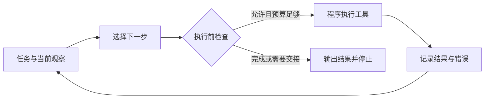

# Agent 与 Workflow：谁来决定下一步

假设客服收到一张工单：“报表页面显示 150 条记录，下载的 CSV 只有 120 条，是不是丢数据了？请查明原因，先给我一份回复草稿。”如果只把这句话发给大语言模型（Large Language Model，LLM），它可能列出分页、权限、筛选条件等原因，却不知道这一次究竟发生了什么。更长的提示词可以规定调查方向，不能替代尚未查询的记录。要回答这张工单，程序必须把模型接到可以读取事实的系统，并决定查询结果回来以后做什么。

这就遇到了一个架构问题：开发者事先写好调查顺序，还是允许模型依据刚取得的证据选择下一步？前者通常叫 Workflow；本篇把后者称为 Agent。两者都需要应用代码来运行模型、查询系统并检查结果，模型本身不会因为被叫作 Agent 就取得数据库连接。本篇围绕这张假设工单走完一次调查。工单、记录、接口与结果均为教学构造，没有连接真实客户系统；任务终点是有依据的回复草稿，发送回复和修改数据不在授权范围内。先修是 [Prompt](#/lesson/prompt) 与 [Context Window](#/lesson/context-window)，暂时不需要学习任何 Agent 框架。

## 控制流程写在哪里

工作流（Workflow）把步骤及其衔接方式写在程序里。比如先读取工单，再提取报表编号，查询导出任务，按错误码进入不同分支，最后生成草稿。模型可以负责提取字段、分类和组织文字，但下一步有哪些选择、什么条件进入哪个分支，由预先定义的流程约束。这里的“确定性流程”指控制规则明确，不表示模型每次会生成完全相同的句子。

本篇把智能体（Agent）限定为一种 LLM 应用：模型在任务约束内，结合当前观察，动态选择下一步行动。Anthropic 的工程文章采用了这样的 Workflow／Agent 区分，同时明确指出行业对 Agent 并没有统一用法。因此，这是一套方便分析系统的架构词汇，不是所有产品必须遵守的命名标准。[Anthropic：Building effective agents](https://www.anthropic.com/research/building-effective-agents)

看代码时，不宜靠“调用了几次模型”判断类别。固定执行“写初稿—检查—重写”，即使循环多轮，也可以是 Workflow；预设三条路线，由模型分类后选一条，也仍然可以是 Workflow。更有用的问题是：遇到一个没有预先安排的调查缺口时，下一次查什么，是程序已有的分支给出，还是模型根据结果提出？后者承担的过程决策更多，也更接近这里的 Agent。实际系统可以混合两者，例如 Workflow 固定身份核验与草稿审核，让其中的调查环节使用 Agent。

还要分开模型和整个应用。模型能输出“读取导出任务 J17”的请求，但请求本身不会访问数据库。宿主程序，即运行这套应用的代码，负责检查请求是否合法、调用接口、把结果带回下一次模型输入。本文把这些可由程序执行的能力统称为工具（tool）。工具不一定会修改东西，搜索文档、读取记录也是行动。参数怎样表达、请求怎样传递，留到 [Function Calling](#/lesson/function-calling)。

## 一张工单怎样经过观察、行动和反馈

给这个调查程序三类只读能力：读取工单和附件；查询报表及导出任务的元数据；查找并读取产品文档。应用允许最多 6 次工具调用。开始前，它还规定草稿必须说明差异原因、列出依据，无法确定时指出缺口。预算和交付条件都是本例的设计选择，不是 Agent 的通用标准。

初始观察只有用户的描述。150 和 120 是待核实的两个数字，“丢数据”是用户的猜测，不能直接写成结论。模型先选择读取工单 T42。工具返回报表编号 R8、导出任务 J17，以及附件中的操作时间。此时状态增加了两个可查询的标识，调查才有了明确对象。如果返回多个导出任务，模型应先根据时间和附件消除歧义；猜一个编号继续查，会把后续正确数据接到错误对象上。

第二次行动是查询 J17。假设返回以下记录。它们是教学用的工具返回示意，不是实际 API 协议：

```json
{
  "jobId": "J17",
  "reportId": "R8",
  "startedAt": "2026-09-20T09:00:00+08:00",
  "filters": { "status": "approved" },
  "snapshotCounts": { "approved": 120, "pending": 30 },
  "exportedRows": 120,
  "result": "succeeded"
}
```

这份观察让“筛选条件不同”成为有依据的候选解释。导出任务只选了 `approved`，即已批准记录，导出数也恰好等于 120。但调查尚未完成：150 可能来自另一个时刻，页面也可能用了其他筛选条件。模型下一步选择查询 R8 在导出开始时的页面视图，而不继续无差别搜索所有可能原因。新证据改变了行动方向，这正是反馈的作用。

第三次工具返回：同一报表、同一时刻，页面筛选为全部状态，共 150 条，其中已批准 120 条、待批准 30 条。现在可以手算 $120 + 30 = 150$，差额 $150 - 120 = 30$ 对应未被本次导出筛选选中的记录。这里是应用实际执行查询后得到新观察，模型再依据结果选读产品文档；如果只在回答里写“我已经核对页面”，却没有相应工具结果，就没有完成这一步。保持报表编号与时间一致很重要；如果比较的是昨天的导出和今天的页面，数字碰巧相等仍不足以支持这个解释。

第四次行动读取产品文档，确认这个产品中“页面筛选”和“导出筛选”是否确实可以分别设置。假设文档明确支持这种行为，并指出导出选项所在位置。至此，程序已有对象、时间、两边筛选、数量和规则依据，可以生成草稿：“本次导出 J17 使用‘已批准’筛选，包含 120 条；同一时间页面显示全部状态的 150 条，另外 30 条为待批准。因此，当前数量差异可由筛选条件解释。若要导出全部状态，请在导出设置中选择全部状态后重新生成文件。”

这份草稿还应附上 J17、R8 的查询依据和产品文档链接，让审核者能复核。它没有承诺“所有数据绝对完整”：本次检查解释了数量差异，没有逐行验证每个字段，也没有证明历史上从未发生数据问题。最终状态应记录为“草稿已完成，未发送”，而不是“客户问题已解决”。任务的交付与外部世界的最终结果是两件事。

这段过程可画成一个很小的循环。图里的反馈是工具实际返回的结果，不是模型对自己答案的表扬。



ReAct 研究展示了让语言模型交替组织推理文字和行动、再接收环境观察的做法。它说明了为什么一次写完计划与边做边接收结果具有不同的信息条件。本例借用的是这种交互结构，没有复现论文实验，也不要求应用展示模型的隐藏思考；可审计的记录可以只包含行动、返回结果和简短决策依据。[ReAct 作者项目页：方法概述与示例](https://react-lm.github.io/)

## 反馈必须能改变决定，停止必须有依据

每一轮调用模型时，应用需要提供任务要求和仍然相关的历史：现在查的是哪个报表，取得了什么结果，什么问题尚未解决，还剩多少调用预算。这些内容组成当前运行状态（state）。若只传入最后一段工具文本，模型可能忘记用户要求“先给草稿”；若把全部历史无区别地累积进去，旧猜测又可能掩盖后来的证据。因此，保留关键状态与证据出处，比单纯增加上下文长度更有用。这里的状态保存也不表示模型参数得到训练。

返回值还需要解释。例如，接口报告 `succeeded`，只能说明这次接口操作按它的契约成功，不能单独证明调查结论成立。文档中的步骤则是资料，不会自动扩大用户授权；即使文档建议重新导出，本例仍然只写草稿。宿主程序应独立限制可调用能力，避免把“模型建议做什么”当成“系统已经允许做什么”。

停止至少有三种不同含义。完成停止，是交付条件已有证据支持；交接停止，是缺少权限、关键输入或人的决定；预算停止，是已达到次数、时间或成本上限。Anthropic 在讨论 Agent 时同样强调环境反馈、人类检查点和最大迭代次数等停止条件。本文具体采用的 6 次上限，只为让例子可检查。[Anthropic：Agents](https://www.anthropic.com/research/building-effective-agents)

本例用了 4 次工具，剩余 $6 - 4 = 2$ 次。剩余预算并不要求耗完；第四次之后没有影响结论的关键缺口，就应停止。如果第三次查询返回“历史快照不可用”，第四次可以有针对性地查找工单附件中的同时间截图。仍无证据时，输出“已确认导出筛选为已批准；尚不能核实当时页面状态，请补充截图”，比拿当前页面替代历史页面更忠实于证据。如果同一接口连续给出相同的权限错误，原样重试不会补齐权限，也不应被算作调查进展。

这个循环的收益，是不必提前枚举每一种缺口都由哪个接口补齐；代价则是更多模型请求、工具等待和决策出错的机会。工具结果可能不完整，模型也可能选错查询。增加一次调用是否值得，要看它能否消除影响交付的疑点。对于每单都严格执行相同核查的业务，直接编码 Workflow 往往更容易测试；对于证据分散、后续调查取决于前面发现的任务，可以让 Agent 负责那一段探索，再由明确规则控制边界。

检验这样的系统，不能只问回答读起来是否合理。把假设数据改为“页面也是已批准 150 条”，看它是否撤回原解释；移除历史快照，看它是否保留不确定性；让文档缺失，看它是否把推断写成已确认规则；耗尽预算，看它是否留下可交接的记录。这些变化直接检查观察有没有改变行动，以及停止时报告的状态是否真实。

<details>
<summary>面试怎么回答</summary>

**一分钟回答：** 我会用下一步的控制权区分 Workflow 和 Agent。Workflow 的步骤与分支预先定义，模型可以参与分类、提取和生成；Agent 允许模型根据当前观察动态选择下一步工具和调查方向。完整应用还需要程序执行工具、回传结果、维护状态并检查权限。一次有效循环是观察、选择行动、执行、接收反馈、重新判断，直到有证据满足交付要求，或者因缺少输入、权限或预算而停止。适合固定流程的需求先用 Workflow；确实需要根据中途发现调整路径时，再引入 Agent。

**追问一：有循环、有工具调用，就一定是 Agent 吗？** 不一定。固定“查询订单—查物流—生成回复”，或按预设评分阈值重写三次，都可以是 Workflow。判断时看可选路径和衔接规则由谁决定，不能只数调用次数。实际架构也可以在固定流程里嵌入一个动态调查环节。

**追问二：模型说任务完成了，为什么不能直接结束？** 需要区分“提出完成”和“满足完成条件”。本例要核对同一报表、同一时间、筛选与数量，并给出可复核草稿。如果历史页面无法核实，即使解释很流畅也只能交接。程序能检查字段、调用预算和工具权限，语义判断仍可能需要审核；这种分工降低失控风险，但不保证模型永远判断正确。

</details>

练习：沿用 T42 工单和 6 次工具预算。第三次查询返回：同一时刻的页面也筛选“已批准”，共有 150 条，而导出为 120 条。设计接下来最多两次调查，写出每次想消除的疑点，以及证据仍不足时的最终回复。不要把“工具返回成功”当成“数据完整”。

<details>
<summary>参考思路</summary>

先撤回“30 条待批准未被选中”的解释，因为新观察已经不支持它。第四次可检查 J17 是否存在行数上限或分页截断，返回无上限也不能自动排除其他原因；第五次可核对导出任务与页面使用的访问身份及权限范围，确认两者是否看到了同一组记录。顺序不是唯一答案，关键是每一步都针对现有差异提出可验证的问题。

如果查出明确的行数上限，并有任务配置或文档支持，就按该证据解释并给出后续建议。如果两项检查都不能解释差异，草稿应保留“同一时刻、同一筛选下仍相差 30 条”的事实，列出已排查内容与尚缺的逐行对比证据，交给进一步调查。不要填一个听起来合理的原因，也不要声称已经修复。

</details>
