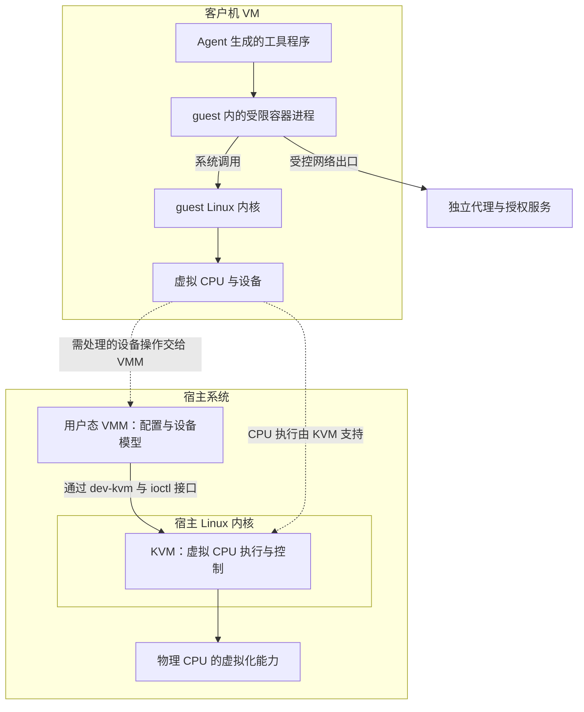

# 智能体沙箱底层：虚拟机、容器与内核权限怎样配合

你让 Agent 在云端运行一段 Python，界面显示“已进入沙箱”。这句话仍没有回答几个具体问题：它能看到哪些目录？能耗尽多少内存？能否连接公网？如果 Python 利用了操作系统漏洞，会影响同一台机器上的其他用户吗？“沙箱”描述的是一组限制及其执行方式，不能只凭这个名字判断边界。

先修是[智能体安全架构](#/lesson/agent-security-architecture)。本篇沿代码真正执行的路径，解释虚拟机、容器和 Linux 内核权限如何配合。资料核验日期为 2026-10-03；下文的短例子都是教学推演，没有运行云资源或测试逃逸。

## 从一个进程走到两套内核

进程（process）是正在执行的程序及其运行状态，包括线程、内存地址空间和打开的文件。线程（thread）是进程内的一条执行流；一个进程可以包含多条线程。内核（kernel）是操作系统中管理处理器 CPU、内存、设备和权限的核心。普通程序在用户态（user space）运行，不能任意修改内核状态；读文件、创建进程、发送网络数据等操作，需要通过系统调用（system call，简称 syscall）请求内核完成。Python 的 `open()` 最终会经过这类接口，但一次高级语言函数调用不一定恰好对应一次 syscall。

传统 Linux 容器把一组进程放进经过配置的运行环境：给它们不同的资源视图、限制资源使用、收窄权限。容器镜像负责提供程序、依赖和文件系统内容；执行隔离还依赖内核机制，所以容器不只是打包工具。容器内进程仍向所在系统的同一套 Linux 内核发起 syscall。换一个 Ubuntu 镜像，不会因此启动第二套 Ubuntu 内核。[Docker 安全文档](https://docs.docker.com/engine/security/)把 namespaces、cgroups、daemon 权限和配置共同列为安全面。

虚拟机（Virtual Machine，VM）则提供虚拟硬件，让客户机操作系统（guest OS）在里面启动自己的内核；承载它的系统称为宿主（host）。虚拟 CPU（vCPU）是 guest 看到的处理器执行单元，最终仍需要物理 CPU 提供执行时间。“4 vCPU”不自动意味着独占四个物理核心。guest 程序的 syscall 先进入 guest 内核，guest 对虚拟硬件的操作再由虚拟化机制处理。这使 guest 与宿主内核的接口关系不同于传统容器。

以 Linux 的 KVM（Kernel-based Virtual Machine，基于内核的虚拟机机制）为例：KVM 位于宿主 Linux 内核，利用 CPU 的硬件虚拟化能力执行和约束 guest；用户态的虚拟机监控器（Virtual Machine Monitor，VMM）负责配置虚拟机、内存和设备模型。VMM 通过 `/dev/kvm`、创建 VM/vCPU 的接口及 `KVM_RUN` 驱动执行。guest 的许多普通指令可在 CPU 上运行，不需要 VMM 逐条软件解释；需要处理的退出事件再进入相应虚拟化路径。[KVM API](https://docs.kernel.org/virt/kvm/api.html)说明了这组接口，[Firecracker 设计文档](https://github.com/firecracker-microvm/firecracker/blob/main/docs/design.md)给出了使用它们的 VMM 实例。

下面是可采用的一种组合，箭头表示执行与访问逐步经过的边界，不是所有沙箱必须拥有的固定层级：



图中 KVM 是宿主内核的一部分，VMM 位于宿主用户态，两者协作，不是每条 guest 指令必须依次穿过的两个软件层。这里要分别问：代码能否离开容器？能否进一步离开 guest？能否通过一个本来就获准的出口发送数据？第三种情况可以完全不涉及“逃逸”。每一层的实现、配置和剩余接口都需要检查，不能把层数当成安全分数。

## VM 不等于 QEMU，管理服务也不等于隔离边界

虚拟化管理程序 hypervisor 是控制 VM 执行与隔离的软件；在 KVM 这条路线中，内核模块与用户态 VMM 分担这些职责。QEMU 是一种 VMM，能提供较丰富的设备模型，还支持不同虚拟化加速方式及软件模拟。Firecracker 是另一种 VMM，用精简设备模型运行轻量 VM，通常称为 microVM；“micro”没有取消 guest 内核。Cloud Hypervisor 也是 VMM，其官方项目说明可运行在 KVM 或 Microsoft Hypervisor 之上。选择会影响兼容性、设备接口数量和运维方式，不能只凭项目名字断言逃逸难度。[QEMU 文档](https://www.qemu.org/docs/master/system/introduction.html)、[Firecracker 设计](https://github.com/firecracker-microvm/firecracker/blob/main/docs/design.md)、[Cloud Hypervisor README](https://github.com/cloud-hypervisor/cloud-hypervisor)

libvirt 提供虚拟化管理 API 与服务；`libvirtd` 是传统单体 daemon，也存在 `virtqemud` 等模块化服务。daemon 是在后台处理请求的服务进程。systemd 则是 Linux 中管理系统服务和生命周期的组件，可以启动这些服务，或借 socket activation 在连接到来时激活服务。因此“管理 API→VMM→虚拟化接口”是一种职责关系，不能画成所有 VM 都有同一个 `libvirtd` 父进程的固定进程树。[libvirt daemon 文档](https://libvirt.org/daemons.html)

Linux/KVM 只是可用路线之一。QEMU 文档还列出 macOS 的 Hypervisor Framework、Windows Hypervisor Platform 等加速接口。本地 Agent 也可能直接使用原生进程限制；WebAssembly（WASM）运行时通过受检查的内存和显式导入接口约束程序，兼容性与完整 OS 不同。gVisor 则在用户态实现大量 Linux 系统接口，由 Sentry 处理应用 syscall，再以较受限的方式使用宿主服务；它不是把应用 syscall 原样转交宿主，也不是一套普通 guest Linux microVM。[Wasmtime 安全机制](https://docs.wasmtime.dev/security.html)、[gVisor 架构](https://gvisor.dev/docs/architecture_guide/intro/)

因此，不能由“云端 Agent”“独立云电脑”反推一定使用 KVM。本篇不会给 Muse、Tencent AGS Cube 或 OpenAI Dots 补上未经披露核准的底层 hypervisor；理解通用机制与确认产品实现是两件事。

## Namespace 改变视图，cgroup 分配资源

命名空间（namespace）把某类系统资源的视图分开，让不同进程组看到各自的实例。比如 PID 是进程编号；PID namespace 可让容器内第一个进程看到自己是 PID 1，而外层用另一个 PID 管理同一进程。mount 是把文件系统接到目录树上的操作；mount namespace 则允许不同进程组拥有不同挂载视图。

当前 Linux 手册列出八类 namespace，具体可用性仍取决于内核版本与配置。它们可以组合，不代表启动一个容器就一定启用了全部八类。[namespaces(7)](https://man7.org/linux/man-pages/man7/namespaces.7.html)

| 类型 | 分离的主要对象 | 它单独不能保证什么 |
| --- | --- | --- |
| Mount | 挂载点与目录树视图 | 已经挂进去的文件不会被读取或写入 |
| PID | 进程编号及可见进程集合 | 程序不能创建过多进程 |
| Network | 网络设备、协议栈、端口等 | 已配置的出口不会向公网发包 |
| User | 用户与组 ID 的映射 | 所有内核漏洞都失去利用条件 |
| IPC（Interprocess Communication） | 进程间通信资源，如消息队列 | 一切文件或网络通信都被切断 |
| UTS（UNIX Time-sharing System） | 主机名与 NIS 网络命名服务域名 | 内存或文件系统隔离 |
| Cgroup | cgroup 根目录及相关路径视图 | CPU、内存额度已经设置 |
| Time | 启动时间与单调时钟的视图 | 任意时钟都可独立改动 |

用户标识 UID（User ID）用于权限判断，UID 0 通常叫 root。User namespace 可将“里面的 UID 0”映射为外层非特权 UID；里面显示 root，不等于拿到外层 root 的全部权限。映射、能力位和共享资源仍须一起配置。尤其是 mount namespace 只分开视图：把宿主敏感目录以可写方式挂进去，会直接把修改能力交给程序。[user_namespaces(7)](https://man7.org/linux/man-pages/man7/user_namespaces.7.html)

控制组（control group，cgroup）把进程组织成层级，用控制器计量和限制资源。cgroup v2 中，`cpu.max` 限制一个周期内的 CPU 时间预算，`memory.max` 约束内存使用，`pids.max` 限制任务数量，包含进程的线程。它主要回答“能用多少”，不会因为设了内存上限就隐藏宿主目录。[cgroup v2 文档](https://docs.kernel.org/admin-guide/cgroup-v2.html)；与之相邻的 [cgroup namespace](https://man7.org/linux/man-pages/man7/cgroup_namespaces.7.html)主要虚拟化路径视图。

假设 `cpu.max` 为 `50000 100000`，单位是微秒：每 100 毫秒周期最多使用 50 毫秒 CPU 时间，是该组所有受该额度约束任务合计的预算，约等于 0.5 个 CPU 的持续用量。额度耗尽会触发节流，程序等待后续预算，并不是“有半颗物理 CPU 专供它”。达到内存上限且回收无效时，可能触发组内内存不足处理；达到任务数量限制时，新的创建请求可能失败。资源控制是在限制耗尽影响，不能代替文件或网络授权。

## seccomp 缩小内核接口，capabilities 收窄特权

安全计算过滤器 seccomp（secure computing）检查进程发起的 syscall。过滤规则可根据系统调用编号、参数值等信息允许、拒绝或终止操作。例如一个只需读取输入并计算的工具，可以不允许加载内核模块等接口。程序即使被诱导发起被禁用的调用，内核也会按过滤策略处理。[seccomp 官方文档](https://docs.kernel.org/userspace-api/seccomp_filter.html)

它不理解“这次 HTTP 请求是否在泄露用户文件”。内核文档也明确指出 syscall filtering 不是完整沙箱：普通过滤器不能解引用参数指针。`openat` 的文件路径在用户内存中，过滤器看到的是指针值，不应据此假定能可靠按路径字符串授权；HTTP 的 method、path 和正文更需要合适的代理或应用权限层解释。放行网络调用后，seccomp 不会自动判定里面的数据来自哪里。

Linux capabilities 是把传统 root 特权拆成可分别启停的能力位，属于线程凭据的一部分。例如 `CAP_NET_ADMIN` 涉及网络配置，`CAP_SYS_PTRACE` 涉及越过通常检查去跟踪其他进程，`CAP_DAC_OVERRIDE` 可绕过部分文件权限检查。移除一个工具不需要的能力，可以减少它执行特权操作的机会；移除能力不是卸载内核功能，也不是把任意代码变成完整沙箱。[capabilities(7)](https://man7.org/linux/man-pages/man7/capabilities.7.html)

这几类原语彼此补足：namespace 限制视图，cgroup 限制用量，capabilities 限制特权，seccomp 限制可达接口。它们可以在宿主上限制容器，也可以在 guest 内限制工具进程。Firecracker 还使用 jailer 约束宿主上的 VMM 进程，并用 seccomp 收窄其 syscall：guest 内受限程序与宿主 VMM 都需要保护，不是只加固其中一个。[Firecracker 的 Sandboxing 与 Threat Containment](https://github.com/firecracker-microvm/firecracker/blob/main/docs/design.md)

## eBPF 和污点：程序必须挂在正确的执行点

扩展伯克利包过滤器 eBPF（extended Berkeley Packet Filter）允许加载受约束的程序，在特定内核事件处运行。挂接点（hook）决定它何时执行、能看到什么以及是否有权阻止操作。跟踪事件的程序可以用于观察，不能由“采集到了事件”推导为“已阻断”。Linux 安全模块 LSM（Linux Security Modules）提供安全检查接口；挂在合适 LSM hook 上的 BPF 程序可返回拒绝结果。内核文档以 `file_mprotect` hook 返回 `-EPERM` 为例，但这不意味着任意 hook 都拥有同样的拒绝能力。[LSM BPF Programs](https://docs.kernel.org/bpf/prog_lsm.html)

污点跟踪（taint tracking）还需要额外模型：给谁贴标签，什么事件改变标签，标签怎样传播，由谁信任与执行。例如可以设计“进程级标签”：新任务开始为 clean（未标记），成功读取指定用户数据后变成 tainted（已标记）；之后创建的子进程继承 tainted，跨进程传递数据时也需要相应传播规则。这里的 clean/tainted 是策略状态，不是内核自动知道每个变量含义。

这是一个假设模型，不是对 Linux 默认功能的描述。它比逐字节追踪粗：只要进程读取过敏感数据，其后一个无关请求也可能被标记；若忽略标签前已经创建的子进程、共享内存、文件中转或其他通信路径，又可能漏掉信息流。标签不能由被约束程序随意清除；需要可信的外部服务依据明确规则处理“解除限制”，否则程序一句“已脱敏”就能绕过控制。内核与标签管理服务本身仍在信任范围内。

Muse 官方描述了一种具体组合：每次工具执行进程起初 clean，读取用户数据后 tainted；tainted 或无法验证的进程失去自动放行资格，转回审批流程。它使用 eBPF cgroup 程序做网络拦截和进程归属，用添加的 LSM hooks 传播污点。正文没有完整披露所有继承与跨进程传播规则，因此不能把它扩写成经过证明的全变量信息流追踪。[Muse 官方安全说明](https://research.meta.ai/blog/security-and-safety-for-ai-agents-our-approach-with-muse)

同一说明将工具运行于 systemd-nspawn runtime container，而 Sentinel、authd 等控制服务位于容器外的用户 VM 内。这里“容器的 host”指容器外的那层 guest Linux 环境，不能自动理解成物理服务器；Sentinel 也不是宿主 hypervisor。systemd-nspawn 本身是容器工具，其官方文档特别要求不可信代码使用 user namespace。[systemd-nspawn 官方源文](https://github.com/systemd/systemd/blob/main/man/systemd-nspawn.xml)

即使进程不能逃逸、不能修改标签，只要允许它读取敏感文件，又批准了能承载这些内容的外发请求，数据仍可能流出。污点提供额外决策信号；数据读取、出口范围、审批依据和强制执行才共同决定这条路径是否开放。

## 用一次文件处理串起这些边界

假设工具只需读取 `/input/numbers.txt`，内容为 `2,3,5`，计算总和，再写入 `/work/result.txt`。可信启动器事先把输入只读挂载、工作目录可写挂载，并且没有把宿主其他目录映射进来。下面是策略规格的伪代码，不是可直接运行的 Linux 配置：

```text
文件视图：/input 只读；/work 可写；不提供其他用户文件
身份：容器 UID 0 映射为外层非特权 UID；移除不需要的能力
资源：cpu.max = 50000 100000；memory.max = 268435456；pids.max = 32
系统调用：采用匹配该运行时的过滤策略
网络：由外部控制点禁止公网出口
```

输入是文件和已配置的环境。过程中，Python 打开 `/input/numbers.txt`：syscall 进入所在内核，文件挂载与权限检查允许读取；写入 `/work/result.txt` 也获准。手算输出为 `10`。如果尝试覆盖输入，正确配置的只读挂载会阻止写入；如果尝试连接公网，由出口策略拒绝；持续计算会消耗 CPU 额度并被节流。MiB 是二进制容量单位，1 MiB 为 1048576 字节；256 MiB 因而等于 `268435456` 字节，但它不是保证 Python 任意计算都能完成的容量。

若工具放在 guest 内，以上检查先由 guest 内核承担。增加 VM 可改变跨用户影响的边界，却不会替你判断 `10` 是否是正确答案，也不会撤回一个被明确允许的外发动作。这就是组合机制的作用范围：外层约束受损后能波及哪里，内层约束正常或恶意操作能做什么。

## 暂停、关机、休眠和快照保存不同状态

运行现场同时存在于磁盘、RAM 和虚拟硬件状态中。RAM（Random Access Memory，随机存取存储器）保存正在使用的内存；磁盘上有文件不等于内存里的 Python 对象也已保存。普通暂停可停止执行，但如果没有另行保存和释放内存，仍需占用 RAM；关机再启动通常是重新启动 OS 和程序，即使持久磁盘还在，也不会自然回到原来的程序调用位置。

休眠（hibernate）会保存用于恢复的内存状态，再停止占用运行资源。Microsoft Dev Box 文档说支持休眠的环境可以保留打开的应用和窗口，并区分支持休眠的新 dev box 与仍执行 shutdown 的旧实例。Azure VM 的休眠机制文档进一步解释：OS 执行 suspend-to-disk，将内存内容存到 OS 磁盘，再释放底层硬件租约并关机。不要把“Dev Box 保留应用状态”扩写成已知采用 Firecracker 快照，也不要把 Azure VM 文档中的全部支持条件直接套给 Dev Box。[Dev Box 配置](https://learn.microsoft.com/en-us/azure/dev-box/how-to-configure-dev-box-hibernation)、[Azure VM 休眠机制](https://learn.microsoft.com/en-us/azure/virtual-machines/hibernate-resume)

VM 快照（snapshot）是另一种保存机制。Firecracker 文档明确列出 guest memory、模拟硬件状态，以及由使用者管理的磁盘文件；恢复还要满足版本和平台等条件。外部网络连接不保证存活，凭证、随机状态和克隆身份也需要处理。因此“保存磁盘”“保存 RAM”“恢复可继续执行的 VM”与“把工作迁到另一台机器”不能画等号。IaaS（Infrastructure as a Service，基础设施即服务）是一种服务交付方式，也不等于裸物理服务器。[Firecracker 快照文档](https://github.com/firecracker-microvm/firecracker/blob/main/docs/snapshotting/snapshot-support.md)

对 Agent，恢复状态还有权限含义：快照中可能保留用户数据和过去的访问上下文，恢复后须确认当前权限仍有效。增加隔离层并不能免去这个检查。下一篇[企业智能体权限](#/lesson/agent-permissions-acl)会把问题从进程能做什么，推进到具体用户能读哪些检索内容。

<details>
<summary>面试怎么回答</summary>

约一分钟的回答：Agent 沙箱是一组受强制执行的约束。传统容器让进程共享所在系统的内核，用 namespace 分开资源视图、cgroup 限制用量、capabilities 收窄特权、seccomp 减少可达的系统调用。VM 则启动自己的 guest 内核；在 Linux/KVM 路线上，宿主内核的 KVM 与用户态 VMM 配合执行虚拟 CPU 和设备。VM 内还可以放受限容器，分别约束用户之间的影响和工具对用户 VM 的影响。文件权限与网络出口仍需单独配置，eBPF 只有挂到适合的执行点才有阻断能力。进程污点可以辅助出口判断，但不能替代授权。最后还要检查恢复状态与管理接口，因为边界的可信组件和允许的出口决定剩余风险。

**追问一：容器里 root 为什么不一定是宿主 root？**

User namespace 可以映射 UID，capabilities 的作用也与 namespace 有关。但不能只看映射就宣布安全，还要核查挂载、保留的特权和内核接口。没有独立 guest 内核的容器仍共享所在系统的内核风险。

**追问二：已经用 seccomp 禁掉危险调用，还需要出口代理吗？**

需要。seccomp 约束 syscall 接口，不能凭常规过滤规则解释完整 HTTP 内容或推断数据来源。允许的网络调用仍可发送敏感数据，出口代理需按目标与具体请求执行授权。

**追问三：VM 内再放一层容器，会让安全性翻倍吗？**

不能这样计算。要说清保护对象、每层的执行点、共有的可信组件，以及哪条路径绕过了哪层。减少可达接口可能减少风险，同时新增管理 API、共享挂载或受信代理也会增加需要检查的对象。

**追问四：磁盘持久化后为什么还需要休眠或快照？**

磁盘保存文件，RAM 保存进程正在使用的对象；恢复执行还可能需要 CPU 和设备状态。休眠或 VM 快照保存的状态范围不同，外部连接与当前授权也不能靠恢复旧内存自动保证。

</details>

## 小练习：定位约束失效的那一层

假设 guest 内工具拥有独立 PID、mount 和 network namespace，内存上限为 256 MiB，capabilities 已收窄，seccomp 已启用。启动器却把用户目录挂进 `/data`，并允许工具向任意公网 HTTPS 地址发请求。工具读取 `/data/private.txt` 后把内容上传了。

它是否一定逃出了容器或 VM？要阻止这条路径，应该调整哪些约束？如果采用进程污点模型，还需要说明什么条件才能可信地阻断？

<details>
<summary>参考思路</summary>

没有证据表明发生逃逸。读取可见且获准的文件、调用获准的网络出口，都能在边界内完成。应缩小挂载或读取权限，将出口限制到确有需要的目标与动作，并让程序无法更改执行策略。内存限制不会改变这条信息流。

污点模型还须定义成功读取时如何标记、子进程与跨进程数据如何传播，以及哪个可信控制点检查出口。标签应由受保护组件管理，无法验证的状态需要明确处理。若用户仍批准发送该文件内容，污点也不自动撤销授权；机制是否阻断与批准范围是否正确必须分别检查。

</details>
