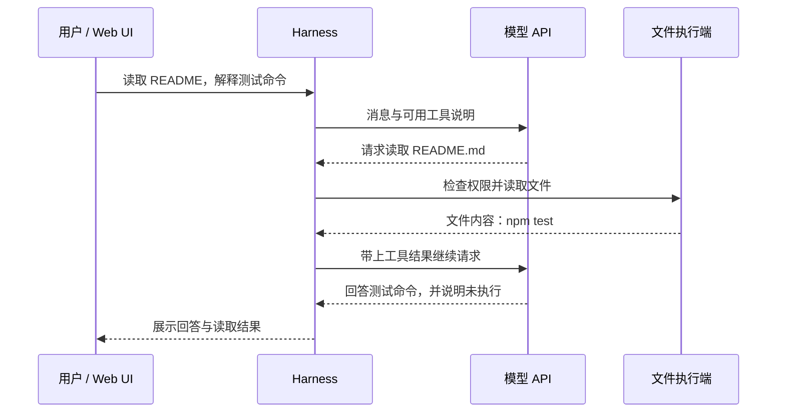

# DeepSeek Harness 入门：它是什么，安装后运行什么

运行 `npx @deepseek-ai/dsh web` 后出现一个聊天页面，这时安装了什么？DeepSeek 模型已经在本机运行了吗？页面能打开，为什么发送任务还要求 API key 和 workspace？这几个问题对应不同层次，分清它们才能判断下一步该配置什么。

DeepSeek Harness（命令名 `dsh`）是 DeepSeek AI 开源的 Agent 执行程序：它组织模型请求、工具执行和会话状态，使模型能根据工具结果继续行动。官方称其架构为 “everything-is-a-plugin”：模型适配器、工具、会话日志乃至 Agent loop 都通过插件组成。[官方 README](https://github.com/deepseek-ai/deepseek-harness/blob/477b4f420553e8a52c2fbccc464d7561b239c443/README.md)、[架构说明](https://github.com/deepseek-ai/deepseek-harness/blob/477b4f420553e8a52c2fbccc464d7561b239c443/docs/architecture.md)

本文于 **2026-10-03** 核验，以本次安装的 `0.1.7-rc.2` 为主，核心引文固定到对应 release 源码 `477b4f420553e8a52c2fbccc464d7561b239c443`。本机 npm 源的 latest 指向此版；直接查询公共 registry 遇到 TLS 错误，未独立确认公共源的最新发布状态。另查开发分支 `da00f7f5358f2949383b35c14f548bc20187d80c`，其 CLI 版本已是 `0.2.0-rc.2`，不能与安装包混为一版。课程整合任务在 Windows ARM64、Node.js 24.16.0 上验证了 npm 全局安装、版本与帮助命令、Web 监听和界面打开；未配置或调用模型，因此没有模型回答或工具任务成功的实测结果。[release 版本](https://github.com/deepseek-ai/deepseek-harness/blob/477b4f420553e8a52c2fbccc464d7561b239c443/apps/cli/package.json)、[开发分支版本](https://github.com/deepseek-ai/deepseek-harness/blob/da00f7f5358f2949383b35c14f548bc20187d80c/apps/cli/package.json)

## 模型、API 与 Harness 各做什么

模型收到消息后生成文字或工具调用。它生成的 `read_file` 参数仍是一段数据，需要程序真正打开文件，读取内容，再把结果送回模型。Harness 承接这段执行过程；Web UI 只是用户观察和操作它的一种界面。

| 层次 | 负责什么 | 安装 `dsh` 是否等于得到它 |
| --- | --- | --- |
| 模型（model） | 根据上下文生成回答或动作请求 | 不等于下载模型权重 |
| 模型 API | 向托管或自建推理服务发送请求 | 还要有可用端点、模型和凭据 |
| Harness | 组装请求、派发工具、记录结果并继续执行 | 安装的是这套程序及其依赖 |
| Web UI | 输入任务、配置模型、选择工作区、展示会话 | `web` 启动对应应用 |
| shell 与文件系统 | 实际执行命令和访问文件 | 能力取决于执行环境、插件与权限 |

通过远端 API 使用模型时，推理服务负责运行模型，通常不需要本机 GPU。若接入自己部署的模型服务，权重、推理引擎和算力要由那套服务另行准备。`dsh` 的模型适配器负责与服务通信，不会因为安装了 npm 包就自动拥有一个离线模型。[模型配置指南](https://github.com/deepseek-ai/deepseek-harness/blob/477b4f420553e8a52c2fbccc464d7561b239c443/docs/user/guide/providers.md)

这里也要区分 DeepSeek Elastic Compute（DSec）。它是为大规模 Agent 训练和评估供给隔离、有状态执行环境的沙箱平台，论文讨论 FnCall、容器、microVM、完整 VM 的生命周期和资源管理。Harness 组织一次 Agent 的交互与工具调用；DSec 管理许多任务执行环境。两者处于不同系统层次，安装 `dsh` 不代表部署 DSec，也不代表开始强化学习训练。[DSec v1 摘要及第 2 节](https://arxiv.org/html/2609.22978v1)

若“一次模型请求”和“多轮行动”还不清楚，可先读[一次 LLM 请求](#/lesson/llm-basics)与[Agent / Workflow](#/lesson/agent-basics)。

## 从安装到一个可发送任务的会话

官方 npm 入口使用 `npx`。它找到或取得指定 npm 包，再运行包提供的命令。全局安装则把包安装到 npm 的全局位置，让 `dsh` 能作为命令反复使用。这两条路径取得的是 JavaScript 程序与依赖，和下载模型权重是两件事。[启动说明](https://github.com/deepseek-ai/deepseek-harness/blob/477b4f420553e8a52c2fbccc464d7561b239c443/README.md#run)

下面是命令用法，`C:/work/dsh-playground` 是已存在的练习目录示例；两种安装方式任选一种：

```powershell
Set-Location 'C:/work/dsh-playground'
npx @deepseek-ai/dsh@0.1.7-rc.2 web

# 或先全局安装，再启动
npm install -g @deepseek-ai/dsh@0.1.7-rc.2
dsh --version
dsh web
```

固定版本便于复查。若从源码运行，官方步骤是 `pnpm install`、`pnpm run build`、`pnpm dsh web`；最后一条使用构建产物，不负责重新构建。单独 `git clone` 得到的是源码，尚未启动应用。[源码启动契约](https://github.com/deepseek-ai/deepseek-harness/blob/477b4f420553e8a52c2fbccc464d7561b239c443/apps/cli/reference/README.md#source-execution)

`dsh web` 选择名为 `web` 的 profile。**Profile 是运行配置**，决定加载哪些插件；它不是项目目录。官方默认 Web 地址为 `http://127.0.0.1:3080`，本地启动通常会打开浏览器，`--no-open` 只关闭自动打开行为。服务仍需保持运行。[CLI 入口](https://github.com/deepseek-ai/deepseek-harness/blob/477b4f420553e8a52c2fbccc464d7561b239c443/apps/cli/README.md)、[Web 参数](https://github.com/deepseek-ai/deepseek-harness/blob/477b4f420553e8a52c2fbccc464d7561b239c443/apps/cli/reference/README.md#web-profile)

此时先配置模型：进入 **Settings → Models**，保存 DeepSeek API key；其他已支持的 provider 或自定义 API 走对应表单。再点 **Choose workspace**，添加并选择项目目录。启动命令所在目录提供默认文件系统位置，但新 Web UI 没有自动选中的 workspace，选好后才能使用会话输入框。模型凭据和工作区分别解决“向哪里请求推理”和“对哪份文件执行任务”。[Web 使用指南](https://github.com/deepseek-ai/deepseek-harness/blob/477b4f420553e8a52c2fbccc464d7561b239c443/docs/user/guide/index.md)

配置存放位置也有三种含义：

| 位置 | 用途 |
| --- | --- |
| 当前启动目录 / 所选 workspace | 任务操作的项目文件 |
| `$DSH_HOME/profiles/web/` | Web profile 的插件清单及 `cordis.patch.yml` |
| `$DSH_HOME/.credentials.yaml` | 保存凭据；模型设置持有凭据引用 |

`$DSH_HOME` 表示环境变量指定的 Harness home；未指定时默认是当前操作系统用户的 `~/.dsh`。这里采用文档的路径记法，在 PowerShell 中读取变量使用 `$env:DSH_HOME`。模型页保存后返回脱敏描述，不会把原始 key 回传页面。[路径实现](https://github.com/deepseek-ai/deepseek-harness/blob/477b4f420553e8a52c2fbccc464d7561b239c443/packages/util/home-paths/src/index.ts)、[凭据与模型配置](https://github.com/deepseek-ai/deepseek-harness/blob/477b4f420553e8a52c2fbccc464d7561b239c443/docs/user/guide/providers.md)

界面可以在没有模型 key 时启动：本次安装检查停在提示配置 API key 的界面。页面加载证明 Web 服务与前端能工作；要证明模型可用，还需要发送请求并取得返回内容；要证明 Agent 执行可用，还需要实际工具结果。不要把这三层验收合成一个“跑通”。

## 底层原语怎样连接成一次执行

原语是构成系统的基本操作或接口。这里先记住五个：模型适配器把统一请求转成 provider 协议；工具注册表给模型描述可用操作；执行端实际访问文件或启动子进程；会话日志保存消息与动作结果；Agent loop 决定读完结果后是否再请求模型。Cordis 是组织这些插件的框架，提供共享 context、服务、事件和随插件卸载撤销的注册效果。[架构与能力接口](https://github.com/deepseek-ai/deepseek-harness/blob/477b4f420553e8a52c2fbccc464d7561b239c443/docs/architecture.md)

假设练习目录中的 `README.md` 有一行 `npm test`，输入任务：“读取 README，告诉我测试命令；不要执行测试。”以下是**教学轨迹，不是本次实测**，工具名只是示意：



关键在于两次模型请求之间多了真实执行：模型第一次不能仅凭文件名知道内容；执行端读取后，Harness 把结果加入上下文，第二次请求才有依据。任务明确不执行测试，最终回答也应保留这个边界。若模型直接猜出 `npm test`，即使猜对，也不构成读取文件的证据。

官方将一次模型请求及其工具调用称为一个 **step**，一次用户交互对应的 **turn** 可含多个 step。UI 展示的是这条执行链的状态；关闭或恢复页面与恢复模型、工具及会话状态之间的关系要另行考察。[官方 turn flow](https://github.com/deepseek-ai/deepseek-harness/blob/477b4f420553e8a52c2fbccc464d7561b239c443/docs/architecture.md#turn-flow)

模型配置还有协议层的边界。自定义 API 可选择 OpenAI Chat Completions、OpenAI Responses 或 Anthropic Messages。网关宣称 OpenAI-compatible，并不保证接受同样的 system role、输出上限字段、reasoning 参数或图片输入。例如固定源码指南为某些网关提供 `supportsDeveloperRole: false` 与 `maxTokensField: max_tokens`：它们改变请求形状，不证明端点一定支持工具调用。适配器、端点和所选模型都要匹配，最终仍靠真实调用验证。[请求兼容性说明](https://github.com/deepseek-ai/deepseek-harness/blob/477b4f420553e8a52c2fbccc464d7561b239c443/docs/user/guide/providers.md#request-compatibility)

## 成本与局限：先确定程序能接触什么

多轮执行意味着重复发送上下文、支付模型推理费用，并等待文件或命令返回。上述假设轨迹有两次模型请求，一次文件读取；读取结果也可能成为第二次请求的输入 token。工具执行不会因为模型只生成了短短一行参数而免费或没有副作用。本文没有测量 token、延迟或费用，不能据此给出具体预算。

固定源码的 base 配置包含默认开启的 DeepSeek session-log 上传，以及由反馈触发的 OTel 上传；两者是不同通道，导出内容可能包括消息、工具参数、结果和 workspace 路径。本次整合任务在 Web profile 中关闭了前者并禁用了 OTel，没有因此验证所有网络行为。使用真实文件前应查看自己的版本与配置，不要从“本地 Web UI”推断数据始终只留在本机。[部署默认行为](https://github.com/deepseek-ai/deepseek-harness/blob/477b4f420553e8a52c2fbccc464d7561b239c443/apps/cli/reference/README.md#shared-deployment-behavior)

官方同时明确：项目处于 developer preview，可能发生不兼容变更，尚未经过安全审计，不能当成生产就绪软件。它能运行模型提出的命令、加载第三方插件并访问被授予的资源；workspace、approval 和 sandbox 能约束操作，但不保证隔离。尤其不能把 Windows 界面中的 Read Only 当成已经证明的操作系统安全边界。练习从无敏感数据的独立目录开始，再核对当前平台的执行后端和授权策略。[SAFETY](https://github.com/deepseek-ai/deepseek-harness/blob/477b4f420553e8a52c2fbccc464d7561b239c443/SAFETY.md)

接下来分别读[执行循环](#/lesson/deepseek-harness-loop)、[插件组成](#/lesson/deepseek-harness-plugins)与[状态和安全](#/lesson/deepseek-harness-state-security)。它们解释多轮任务怎样继续、能力怎样替换，以及哪些状态与权限需要保留。

<details>
<summary>面试怎么回答</summary>

**一分钟回答：** DeepSeek Harness 是运行 Agent 的开源程序。模型通过 API 生成回答或工具请求，Harness 执行工具、保存结果，再把观察送回模型。安装 npm 包得到程序与依赖，不等于下载模型权重。`dsh web` 选择 Web profile，启动界面后还要配置模型并选择 workspace。它基于 Cordis 组合插件，但协议兼容、工具权限和平台隔离都需要分别验证；Web UI 能打开只证明应用启动。

**追问一：已有模型 API，为什么还需要 Harness？** API 可以返回动作请求，但不会替应用管理本地文件、命令、后续请求和日志。简单问答可以直接调用 API；需要多轮执行时，这些职责必须由 Harness 或自己编写的程序承担。

**追问二：选择 workspace 是否就把所有访问限制在目录里？** 不能这样推断。Workspace 指明任务项目；文件写入、读取、网络和子进程受到哪些限制，由权限策略与执行后端共同决定。要检查当前配置及实际执行行为，不能从目录选择器推导安全结论。

**追问三：换一个 OpenAI-compatible 模型服务能直接复用吗？** 可能需要改协议和兼容参数。模型目录能列出 ID，不等于推理、reasoning 与工具调用都可用，应依次验证对应请求。

</details>

**练习：** 某人安装 `dsh` 后打开 Web UI，添加了项目目录，却在第一条消息遇到 `MISSING_CREDENTIAL`。他认为“安装漏掉了模型文件”，准备重新下载源码。指出已经验证的层次、尚未验证的层次，以及最直接的下一步。

<details>
<summary>参考思路</summary>

已验证的是程序和界面启动，目录添加也不代表工具读取已执行。错误指向模型凭据，尚未验证模型 API 请求。先在 Models 配置所选 provider 的 key，或按配置提供对应环境变量，再发送最小请求检查返回；随后用明确的只读任务验证工具路径。重新下载源码既不会补上远端 API key，也不能证明模型权重曾经缺失。[官方故障说明](https://github.com/deepseek-ai/deepseek-harness/blob/477b4f420553e8a52c2fbccc464d7561b239c443/docs/user/guide/providers.md#troubleshooting)

</details>
