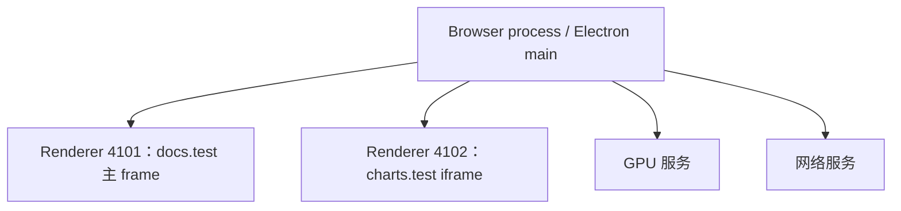

# Electron 与 Edge/Chromium：进程怎样创建、通信和退出

**Electron 是用 JavaScript、HTML 和 CSS 构建桌面应用的框架**，它把 Chromium 和 Node.js 嵌入应用。Chromium 是开源浏览器项目，提供网页运行、渲染和多进程架构；Edge 是采用 Chromium 的浏览器产品。Electron 让开发者用网页技术做桌面界面，并通过应用代码安排本机能力；Edge 的标签页与后台行为则由浏览器产品管理。[Electron 简介](https://www.electronjs.org/docs/latest/)、[Edge 的 Chromium 架构](https://learn.microsoft.com/en-us/troubleshoot/microsoft-edge/performance/edge-high-cpu-memory)

这解释了一个常见困惑：假设只打开两个 Edge 标签页，Windows 任务管理器却列出十几个 msedge.exe；一个 Electron 应用只有一扇窗口，也带着好几个同名进程。关掉窗口后，其中一些还在。**进程**（process）是操作系统管理的执行环境，有自己的地址空间；**线程**（thread）是进程内的执行单元。页面是加载的文档及其运行状态，标签页和窗口是承载内容的应用对象。它们属于不同层次，所以窗口数、页面数、线程数与进程数不能相互直接换算。要判断后台进程是否正常，得知道谁执行页面、谁管理它，以及“关闭”结束了哪一层。[Chromium 进程模型](https://chromium.googlesource.com/chromium/src/+/main/docs/process_model_and_site_isolation.md)

本文只需基本编程知识，是 WorkBuddy 桌面路径的基础选读。后续篇另以 5.6.2 安装代码分析产品实例；这里依据官方文档解释通用机制。原资料核验于 2026-09-29，Electron 定义、进程分工、退出事件与 Chromium 进程模型的官方片段补充核验于 2026-10-01；这些资料不代表当前电脑的版本或配置。

贯穿例子是一个**教学假设**：文档站 `https://docs.test/editor` 嵌有跨站 iframe `https://charts.test/view`，另一个标签页打开 `https://docs.test/help`。iframe 是页面中嵌入的子页面框架。随后把编辑页装进 Electron 文档客户端：用户点击按钮查询已启动的导出任务，界面显示任务状态，再观察导航、崩溃和关窗后的变化。所有 PID、消息返回值和故障均为假设，没有枚举用户标签页、运行示例、终止进程或实际抓包。

## 谁管理窗口，谁运行网页

在 Chromium 的结构里，**浏览器进程**（browser process）管理浏览器并协调页面，**渲染进程**（renderer process）执行网页代码并参与渲染。GPU、网络等工作还可能交给相应服务进程。扩展、子框架及其他功能也会增加任务管理器里的条目。这样拆分，某个 renderer 出问题时，其他进程还有机会继续工作；代价是多份运行环境、跨进程通信和管理成本，不能只用进程数评价内存效率。[Site Isolation 设计](https://www.chromium.org/developers/design-documents/site-isolation/)、[Edge 任务管理器说明](https://www.microsoft.com/en-us/edge/learning-center/how-to-use-edge-task-manager)

Electron 继承 Chromium 的多进程架构，并把应用开发接口交给开发者。一个应用实例的入口是**主进程**（main process），它运行在 Node.js 环境中，可以使用 Node API，并通过 BrowserWindow 创建和管理原生窗口。本例中的 main 创建文档客户端窗口，窗口内的 HTML、CSS、页面 JavaScript 交给 renderer。操作系统启动应用后，Electron/Chromium 根据窗口和服务需求安排子进程；页面中的一段 JavaScript 不会仅因开始执行就得到一个新进程。具体系统上可能还有进程启动辅助机制，所以逻辑管理关系也不应硬画成所有子进程都由同一个 PID 直接创建。[Electron Process Model](https://www.electronjs.org/docs/latest/tutorial/process-model)

Edge 的 browser process 与 Electron main 在职责上相似，但不能互换概念。Edge 是现成浏览器，产品代码决定标签页、扩展和后台运行策略；网站作者不能借此获得 Electron 主进程那样的 Node 接口。Electron 是构建应用的框架，开发者决定创建什么窗口、允许导航到哪里、是否留在托盘，以及向页面开放哪些本机能力。共享 Chromium 不意味着两个产品拥有相同窗口策略或权限配置。

以下对应关系比“一个窗口一个进程”更适合排查问题：

| 对象 | 表示什么 | 不能据此推断什么 |
| --- | --- | --- |
| BrowserWindow | Electron 管理的一扇原生窗口 | 整个生命周期永远绑定同一 PID |
| webContents | 主进程中控制网页内容的对象，有独立 ID | 对象 ID 就是操作系统 PID |
| 文档与 frame | 某次加载的页面及其框架 | 同一标签页内全部 frame 在同一进程 |
| renderer PID | 某次实际运行的操作系统进程 | PID 就是页面、用户或业务会话身份 |
| session / partition | 页面使用的会话及存储分区配置 | 同分区必然共进程，或换 PID 必然退出登录 |

`webContents.id` 标识对象；`getOSProcessId()` 返回关联 renderer 的操作系统 PID；`getProcessId()` 返回 Chromium 内部编号，二者也不能混用。BrowserWindow 的 partition 配置决定页面使用哪个 Session，`persist:` 前缀表示持久会话。同一分区可以被多个页面使用，这与 renderer 的分配是不同维度。[webContents API](https://www.electronjs.org/docs/latest/api/web-contents)、[BrowserWindow 配置](https://www.electronjs.org/docs/latest/api/browser-window)

## 两个标签页，为什么不止两个 renderer

假设文档编辑页的顶层框架（main frame）此刻由 PID 4101 运行，跨站图表 iframe 由 PID 4102 运行。PID 是操作系统给进程分配的编号。用户仍只看见一个标签页，但页面内容已经横跨两个进程。**进程外 iframe**（Out-of-Process iframe，OOPIF）允许子框架与父框架由不同进程渲染。browser process 跟踪完整框架树，协调导航、输入和画面组合；不要求页面作者把两块画面拼成两个浏览器窗口。[Chromium OOPIF](https://www.chromium.org/developers/design-documents/oop-iframes/)

下面只画这个假设页面的逻辑分工。箭头表示协调关系，不是固定的操作系统父子进程树，也没有列出全部进程。



这与站点隔离（Site Isolation）有关。浏览器把不同站点的敏感数据限制在不同 renderer 边界内，而不只依赖一个 renderer 内部的 JavaScript 检查。这里的 site 也不是 origin 的同义词：origin 通常由协议、主机和端口共同确定；Chromium 文档中的 site 通常按协议加可注册域名组织，某些情形又使用更细的 origin 隔离。本例选 docs.test 与 charts.test，就是避免把“子域不同”草率等同于“必定跨站”。[Chromium 当前进程模型](https://chromium.googlesource.com/chromium/src/+/main/docs/process_model_and_site_isolation.md)

第二个 docs.test/help 标签页会怎样？同站点并不保证一定复用 PID 4101。有关联且需要同步互相访问的文档必须满足共同运行的约束；无关联的同站点标签页可以分开，进程复用还受平台和资源策略影响。反过来，多个页面也可能共享 renderer。所以两标签页对应几个进程，是运行时分配结果，不是固定公式。Electron 的介绍教程用“每窗口一个 renderer”帮助入门，不能据此否定 Chromium 的 frame 隔离、复用和导航换进程。

接着，用户把编辑页导航到 `https://reports.test/`。假设此次跨站导航选用了 PID 4103，标签页还在，内容所属进程已经改变；旧 PID 4101 是否退出，要看是否还有其他内容或保留状态使用它。Electron 中也应区分持续存在的 BrowserWindow/webContents 与它当时承载的文档、renderer。一次 PID 变化不等于用户新建窗口，也不等于应用重启。Chromium 的 SiteInstance、BrowsingInstance 等对象正是为这些内容关系和导航选择提供依据；这里不要求背类名，先理解“页面容器比当前文档和进程活得更久”。[Site Isolation 的导航要求](https://www.chromium.org/developers/design-documents/site-isolation/)

## preload、context isolation 和 sandbox 隔离的是不同东西

现在把编辑页放进 Electron 文档客户端。页面负责显示导出状态按钮，主进程负责接触本机资源，中间需要一层明确的接口。**预加载脚本**（preload）在网页脚本之前运行，仍是 renderer 里的脚本，不是独立后台进程。它可以向页面提供经应用选择的能力。沙箱开启时，preload 可使用受限的 Electron/Node 补充接口，不能笼统称它拥有完整 Node 环境。[Electron 沙箱行为](https://www.electronjs.org/docs/latest/tutorial/sandbox)

上下文隔离（context isolation）把 preload 与网页代码放在不同的 JavaScript context 中。例如两边看到的 window 对象不同，网页不能靠修改自己的全局对象直接改掉 preload 的全部内部状态。这是同一 renderer 内的 JavaScript 环境边界，不是另起一个操作系统进程。需要有意开放能力时，用 contextBridge 定义桥接接口。[Context Isolation](https://www.electronjs.org/docs/latest/tutorial/context-isolation)

沙箱（sandbox）则限制 renderer 对操作系统资源的直接访问，特权动作需要交给更有权限的进程。它与同源策略也不同：同源策略管网页来源之间的访问规则，沙箱管进程对系统的能力；站点隔离再利用进程边界保护不同站点的数据。三者可以配合，但开启其中一个，不会自动补全其他层。当前 Electron 文档说明，启用 renderer 的 nodeIntegration 会关闭该 renderer 的沙箱，因此不能把它当成无关紧要的打包开关。[Process Sandboxing](https://www.electronjs.org/docs/latest/tutorial/sandbox)

在本例中，来自 charts.test 的 frame 不应该因为“它画在我们的窗口里”，就获得查询本机任务的所有权限。同样，contextBridge 暴露的函数即便来自 preload，也需要控制参数和调用来源。隔离解决边界在哪里，应用仍要决定哪些请求能穿过边界。

## 一次 IPC 请求怎样从按钮到主进程

进程间通信称为 IPC，Inter-Process Communication。Electron 的 ipcRenderer 与 ipcMain 使用应用定义的 channel 传消息；网页先通过 preload 暴露的窄接口请求动作，主进程检查后返回结果。`invoke` 配合 `handle` 适合这种请求—响应：renderer 得到 Promise，返回值经消息机制传回，并非两个进程共用一个普通 JavaScript 对象。[Electron 双向 IPC](https://www.electronjs.org/docs/latest/tutorial/ipc#pattern-2-renderer-to-main-two-way)

本例输入是用户在编辑页点击“查看导出状态”，输出是假设返回值 `{ state: 'running' }` 所对应的“导出中”。请求经过以下步骤：

1. 页面调用 preload 暴露的 `getExportStatus()`，不选择任意系统操作。
2. preload 固定向 `export:status` channel 发出请求，renderer 等待 Promise。
3. main 校验发送窗口、顶层 frame 和页面 URL，读取已启动任务的状态。
4. 状态作为普通数据返回，页面用 `status.state` 更新显示。

下面是原创、简化的 JavaScript 示意，与上述假设对应。假设 docs.test/editor 是此测试应用允许的受控顶层页面，主进程已经创建 win，并保存当前窗口的导出状态；辅助函数由应用实现。代码省略初始化、导航策略和错误呈现，不是完整安全实现。

```javascript
// main.js：主进程。假设 win 是该受控窗口。
const { ipcMain } = require('electron');
ipcMain.handle('export:status', (event) => {
  const frame = event.senderFrame;
  if (event.sender !== win.webContents ||
      frame !== win.webContents.mainFrame ||
      frame?.url !== 'https://docs.test/editor') {
    throw new Error('Request source not allowed');
  }
  return readCurrentExportStatus(); // 返回普通数据，如 { state: 'running' }
});

// preload.js：renderer 的隔离上下文。
const { contextBridge, ipcRenderer } = require('electron');
contextBridge.exposeInMainWorld('desktop', {
  getExportStatus: () => ipcRenderer.invoke('export:status')
});

// renderer.js：网页上下文。
const status = await window.desktop.getExportStatus();
showExportState(status.state);
```

这里的接口只查询状态，没有让页面提供任意路径、命令或 channel，也没有把原始 ipcRenderer 暴露出去。来源检查同样不能证明这个站点的内容永远可信，因此真实应用还须控制导航、内容来源及能力范围；有参数的接口也要在主进程校验。**隔离提供边界，授权决定什么能通过边界。** 官方特别指出，直接转交整个 send/invoke 接口会允许页面发送任意 IPC。[桥接的安全边界](https://www.electronjs.org/docs/latest/tutorial/context-isolation#security-considerations)

跨站 iframe 的网页通信则属于另一层。Chromium 可以通过 frame 的代理和 browser process 路由 postMessage，而不是把 Electron 的任意 ipcMain channel 交给所有网页。把两者都叫“发消息”没有错，但消息接收者、权限和生命周期不同。[OOPIF 跨进程交互](https://www.chromium.org/developers/design-documents/oop-iframes/)

## 卡住、崩溃与退出，影响范围怎样判断

查状态很轻，但被查询的导出任务可能计算很重。如果把它写成 main 中的长时间同步循环，主进程就难以及时处理窗口和 IPC。**async 不会自动产生新线程**；计算仍可能堵住同一事件循环，也就是处理回调与事件的运行机制。Electron 的 utilityProcess.fork 可以启动带 Node.js 和消息端口的独立子进程，适合需要独立生命周期的工作。本例可由 main 管理这样的导出进程，renderer 只负责查询和显示结果。utility process 有自己的 PID、spawn/exit 事件及终止接口；“utility”这个名称不意味着自动获得低权限沙箱。Node 的 worker_threads 则在同一进程中增加线程，可通过受控共享内存通信，并不增加同等的操作系统进程隔离。[utilityProcess](https://www.electronjs.org/docs/latest/api/utility-process)、[Node 并发模型](https://nodejs.org/learn/concurrency/comparing-nodejs-concurrency-models)

回到 PID 4101/4102 的例子。如果只有图表 renderer 4102 崩溃，损坏范围通常局限于它承载的内容；主页面所在进程可以仍然运行。如果几个 frame 或页面共享 4102，它们也可能一起受影响。renderer 不响应与进程已消失也不同：前者可能仍活着，只是没有及时处理事件；后者意味着原执行环境已经结束。共享的 browser/main 或 GPU 等服务出问题，影响又可能跨越多个页面，不能用“一个标签页报错”反推出唯一故障位置。

Electron 为 webContents 提供 unresponsive、responsive 和 render-process-gone 等不同事件。最后一个事件报告 renderer 意外消失，details 给出原因等信息；它不是页面加载失败事件，也不保证业务请求可重放。应用可以在用户确认和状态核对后重新加载，但新 renderer 不会自动恢复旧 JavaScript 堆中的草稿或未回传结果。本例若导出已写入文件、界面随即崩溃，重载页面后应该先查导出状态，不能因为 Promise 没返回就再创建一次任务。[webContents 事件](https://www.electronjs.org/docs/latest/api/web-contents#event-render-process-gone)

用户接着点击窗口的关闭按钮，仍不能据此判断导出是否结束。隐藏窗口、关闭窗口、退出应用是不同操作。Electron 的 win.close 会尝试关窗，页面可能阻止关闭；应用可以订阅 window-all-closed，自行决定是否退出，例如保留托盘。正常 app.quit 路径会触发 before-quit，但处理器可以阻止退出，官方说明 Windows 因系统关机、重启或用户注销关闭应用时不发出该事件。因而任务数据需要及时持久化，不能只等最后一刻保存；开发者还须为自己创建的辅助进程安排关闭策略。判断关闭失败时，要确认窗口是否真的关闭、应用是否请求退出、是否有处理器阻止，以及辅助任务是否按既定策略收尾。[BrowserWindow.close](https://www.electronjs.org/docs/latest/api/browser-window#winclose)、[app 生命周期](https://www.electronjs.org/docs/latest/api/app#event-before-quit)

Edge 关闭全部窗口后仍有进程，需要分开看两种策略。StartupBoostEnabled 允许在系统登录时启动进程，并在最后窗口关闭后后台重启，以准备下次启动；BackgroundModeEnabled 则允许继续运行后台应用，保留当前浏览会话及 session cookies。后台模式已经维持运行时，并不需要再靠 startup boost 重启。这些条件不能从“还有 msedge.exe”反推是否开启，更不能直接认定泄漏；持续资源用量与实际策略才是调查依据。[Startup boost 政策](https://learn.microsoft.com/en-us/deployedge/microsoft-edge-browser-policies/startupboostenabled)、[Background mode 政策](https://learn.microsoft.com/en-us/deployedge/microsoft-edge-browser-policies/backgroundmodeenabled)

标签页休眠又不同于关闭。Edge sleeping tabs 基于 Chromium freezing，暂停部分执行以节省资源，回到标签页时通常可继续原页面。discard 则丢弃页面内容，回来需要重新加载；标签页入口可以仍在。两者都不等于“这个标签页对应的独占 PID 已被杀掉”，因为它本来就未必独占进程。具体何时休眠由配置与活动条件决定，本文不采用统一默认超时。[Sleeping 与 discarded 的区别](https://support.microsoft.com/en-us/edge/learn-about-performance-features-in-microsoft-edge)

## 排查时，把窗口、PID 和业务任务对应起来

Edge 可用 Shift+Esc 打开 Browser Task Manager，按 CPU、内存观察标签页、扩展、子框架和 utility 任务；需要研究页面丢弃状态时，可检查 edge://discards。先找哪项资源持续异常，再判断它承载什么，不要看到一组同名进程就全部结束。任务管理器的任务条目也不应机械当作互不共享的进程计数。[Microsoft Learn 诊断流程](https://learn.microsoft.com/en-us/troubleshoot/microsoft-edge/performance/edge-high-cpu-memory)

自己开发的 Electron 应用可以在主进程用 app.getAppMetrics() 取得相关进程的 CPU、内存统计，用已持有的 webContents.getOSProcessId() 关联当前 renderer，再结合 render-process-gone 和 child-process-gone 事件记录变化。getOSProcessId 不是枚举整个 frame 树全部 PID 的接口；涉及 OOPIF 时，需要另行按 frame 核对。诊断记录至少注明采样时间、webContents ID、当前 PID、事件原因和业务任务状态，避免把导航后的新进程与之前的测量混在一起。[app.getAppMetrics](https://www.electronjs.org/docs/latest/api/app#appgetappmetrics)、[webContents.getOSProcessId](https://www.electronjs.org/docs/latest/api/web-contents#contentsgetosprocessid)

本例最有用的记录不是“有十二个进程”，而是“编辑页还在，图表 renderer 消失；导出任务仍在独立执行；随后页面重新加载并查询同一任务”。这能分别定位显示、执行与结果传递。日志也不必为了关联 PID 收集完整命令行、认证参数或用户所有标签页。理解这些基础后，再读 [WorkBuddy 会话入口](#/lesson/workbuddy-session)，就能把它的 renderer、preload、daemon 与 CLI 放回各自的职责，而不把产品服务名称都当成固定进程数量。

<details>
<summary>面试怎么回答</summary>

**一分钟回答：** Electron 与 Chromium 把窗口管理、网页执行和部分服务放在不同进程中，所以窗口数不等于进程数。一个标签页可因跨站 iframe 使用多个 renderer，同站点页面也不一定共进程。Electron main 有 Node 能力，页面通过 preload 暴露的有限 API 和 IPC 请求主进程工作。preload 仍在 renderer 内，context isolation 是 JavaScript 上下文边界，sandbox 是系统资源边界。导航或崩溃后 renderer PID 可以改变，窗口和业务任务却可能继续存在。诊断要关联对象 ID、PID、事件与任务状态；关窗是否退出取决于应用策略，不能看到后台进程就判断泄漏。

**追问一：为什么不能把所有重计算都改成 async？** async 改变 Promise 的组织方式，不自动增加线程或进程。CPU 密集循环仍会占用执行它的线程。worker_threads 可以在同一进程内并行，utilityProcess 提供独立进程及消息通道，选择要结合数据传递、故障范围和生命周期。

**追问二：contextIsolation 开启后，能否放心把 ipcRenderer 整个交给网页？** 不能。这样会把选择任意 channel 的能力重新交回页面。应按业务能力暴露固定方法，在接收端检查来源和参数；JavaScript 上下文隔离不会替应用完成授权。

**追问三：renderer 重启后，原来的导出是不是也没了？** 不一定。renderer 的内存状态消失，主进程、独立执行进程或外部服务中的任务可能仍然存在。恢复页面后应按任务标识查询结果，不能从界面断开推断副作用未发生。

</details>

练习：编辑窗口的 webContents ID 保持 9，renderer PID 从 4101 变为 4103；session partition 没变，导出工具进程仍在运行。稍后用户关掉窗口，应用仍留在托盘。哪些现象足以证明退出登录、导出失败或进程泄漏？应该再记录什么？

<details>
<summary>练习参考思路</summary>

这些现象都不足以单独证明那三个结论。PID 改变可能与导航或 renderer 重建有关，partition 是另一层会话配置；工具进程仍在运行不等于导出成功或失败；留在托盘可能是设计的退出策略。应记录导航与崩溃事件、实际登录状态、同一导出任务的进度/结果，以及关窗后的资源变化和生命周期日志。若业务已结束，资源仍持续增长或违反既定退出策略，才形成具体缺陷线索。

</details>
