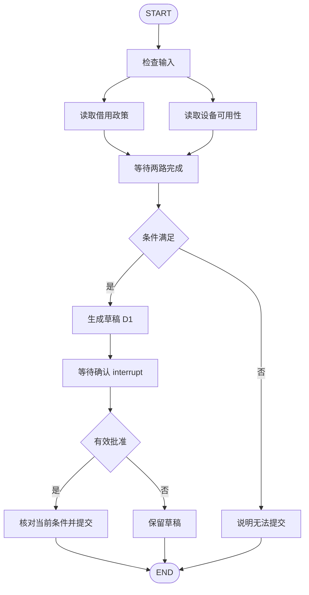

# LangGraph：把 Agent 运行写成一张状态图

假设设备借用助手已经查过借用政策，也查过 CAM-18 的可用日期，生成草稿以后等待用户确认。用户隔了一天才回复“同意”，服务进程期间重启过。普通脚本可能只剩一段聊天记录：不知道确认的是哪份草稿，也不知道该重新查询、直接提交，还是从头运行。如果把判断都交给模型临时推断，原本可以明确保存的进度又变成了语言理解问题。

LangGraph 用状态图组织这类运行：状态保存当前事实，节点完成一段工作，边决定下一步；检查点记录可恢复的位置，暂停机制把控制交还调用方，等外部输入到来再继续。它提供的是执行结构，不会自动理解业务完成条件，也不会因为图画得完整就替应用保证授权或外部写入正确。

LangGraph 是用来编排长任务的开源框架，尤其适合流程有分支、要等待人或要从保存位置继续的情形。对上面的借用申请，应用把“查政策”“查库存”“写草稿”“等用户确认”“提交”写成节点，把草稿版本与查询结果保存在状态里。用户隔天点“同意”时，程序读回状态，才能知道同意的是哪份草稿；框架提供保存和继续的机制，业务校验仍由应用写。[LangGraph 官方概览](https://docs.langchain.com/oss/python/langgraph/overview)

本文假设用户已选定借用日期，要求“为 CAM-18 准备 7 天借用申请，展示后由我确认是否提交”，设备、政策、日期、批准和返回编号都是教学设定。先修 [任务状态](#/lesson/agent-state)、[Planning](#/lesson/planning) 和 [LangChain](#/lesson/langchain) 已分别解释进度、路径与模型接口；这里把它们放进一张可追踪的小图。API 名称按 2026-09-28 官方文档核验，代码仅用于展示契约，没有运行 LangGraph SDK。

## 状态、节点和边怎样配合

状态（State）是图在某一时刻掌握的数据。本例需要用户请求、设备与日期、政策结果、可用性结果、草稿及其版本、确认结果、提交编号。状态不必全部是聊天消息，也不必把全部字段每次都送给模型。查设备节点只需要目标设备与日期，草稿节点则需要政策和可用性结果。

这里的“图”是一张执行路线图，不是知识图谱。节点相当于带输入输出的工作步骤，边说明下一步去哪里。开始时只有请求和日期；查政策、查库存分别补入结果；两份结果齐了才能生成 D1；确认节点把 D1 展示给用户并暂停。这样读图时，每条边都对应一个具体的“现在具备什么、接着由谁做什么”。

节点（node）是执行工作的函数。它接收当前状态，可以调用模型、查询工具，也可以只做普通计算，然后返回状态更新。返回值通常是局部更新，例如只写入 availability 字段，不需要把没有变化的完整状态再复制一遍。边（edge）定义后续节点；固定边表示总是继续，条件边则通过路由函数读取状态，选择下一条路径。[LangGraph：Graph API overview](https://docs.langchain.com/oss/python/langgraph/graph-api)

下面的图描述本例业务路径。两个读取节点彼此不依赖，因此可以并行；生成草稿必须等待二者完成。图中的等待确认是运行暂停的位置，提交和结束之间的分支取决于收到的有效决定。



这里的“汇合”需要在图定义中明确表达为等待两路都完成。不能仅凭图上两根箭头都指向草稿，就假定任意写法都会产生所需的等待语义。在 Graph API 中，可以用来源节点列表定义共同依赖，例如 add_edge 中以两个读取节点作为来源。若分支长度不同，更要检查草稿节点实际会被调度几次。

假设政策查询返回“最长 7 天，需要完整起止日期”，设备查询返回“所选日期可用”。两路结果合并以后，草稿节点生成 D1，并将 draft_version 设为 1。若设备不可用，条件路由可以把 availability.available 为 false 的状态送到“说明无法提交”分支。这里用明确布尔值或枚举决定路径，比让路由再次阅读长篇解释更容易检查。

构建时，应用先定义 State，再登记节点与边，最后 compile。编译会检查部分图结构并绑定 checkpointer 等运行参数；它无法证明“用户确认后才提交”在所有业务路径上都成立。节点函数、条件返回值和可能绕过确认的边，仍需要应用自行验证。

## Reducer 决定并发更新怎样合并

状态更新需要规则。归并函数（reducer）为某个状态字段定义“旧值加上本次更新以后，新值是什么”。没有显式 reducer 的普通字段，单次更新默认覆盖原值；它不是对整个 State 做替换，所以其他未更新字段保留。若同一执行步中两个并行节点都写一个不支持合并的字段，LangGraph 会报并发更新错误，而不是自动挑一个看起来正确的值。[Reducer 语义](https://docs.langchain.com/oss/python/langgraph/graph-api#reducers)、[并发更新错误](https://docs.langchain.com/oss/python/langgraph/errors/INVALID_CONCURRENT_GRAPH_UPDATE)

在借用申请里，查政策节点写入 policy，查库存节点写入 availability，两者写不同字段，可以在汇合后一起供草稿节点使用。如果两者都写同一个 notes 字段，框架需要知道是后者覆盖前者，还是把两份备注合成列表；reducer 就是这条字段级规则。没有规则时让一个结果悄悄盖掉另一个，会让草稿失去一半依据。

本例把政策与设备结果存入不同字段，就能避免它们互相覆盖。两路还各自返回一条 evidence 记录，希望合并成一组证据，因此为这个字段配置列表追加。下面是简化的 Python 状态定义片段，不是完整应用；初始化、类型细节和业务校验被省略。

```python
from operator import add
from typing import Annotated, TypedDict

class BorrowState(TypedDict, total=False):
    request: dict
    policy: dict
    availability: dict
    evidence: Annotated[list[dict], add]
    draft: dict
    draft_version: int
    decision: dict
    ticket_id: str
```

如果初始 evidence 为空，政策节点返回“政策 P7 第 3 版”，设备节点返回“CAM-18 日期查询结果 R8”，列表合并以后会保留两条记录。下游不应依赖它们恰好按节点完成时间排列；如果展示顺序重要，应按照明确字段排序。

列表追加只解决“两个列表如何组合”，不解决事实冲突，也不自动去重。如果节点再次返回已有记录，追加 reducer 可能保存重复项；返回空列表也不会清空已有内容。需要替换、按 ID 更新或去重时，应设计相应规则。两个节点分别判断 allowed 为 true 和 false，则应分别保存各自结论及依据，再由一个节点进行业务决策；把布尔值随意合并，可能抹掉其中一项限制。

图运行按超步（super-step）推进，可以把它理解为一轮调度：这一轮的活动节点读取已有状态并运行，结果按照 reducer 合并，再决定下一轮。两个读取节点可以处在同一超步，草稿节点在后续超步使用合并结果。这里的超步不是一次模型调用，也不是图里任意一个箭头。

## 检查点与 thread_id 保存什么

检查点（checkpoint）保存图状态快照及恢复相关信息，如当前字段值、接下来需要执行的节点和暂停任务。checkpointer 是保存这些信息的组件；完整状态快照通常位于超步边界。官方文档还说明，节点级别的成功写入可以作为 pending writes 保存，用来避免同一超步中别的节点失败后重复计算已成功节点；这与完整检查点是两个层次。[LangGraph：Checkpointers](https://docs.langchain.com/oss/python/langgraph/checkpointers)

本例在两路读取后已有政策与可用性结果，在生成 D1 后已有草稿与版本，在确认节点暂停时已有待确认内容。恢复时不必把全部对话重新解释成进度，但仍需要确认旧查询是否已经过期。昨天“设备可用”不一定意味着今天还能提交；图保存的是过去查到的事实，不会自动刷新外部世界。

thread_id 用于把同一段持续运行的状态和历史关联起来。下面是一小段调用示意，其中 graph 假定已经绑定合适的 checkpointer：

```python
from langgraph.types import Command

config = {"configurable": {"thread_id": "borrow-T8"}}
first = graph.invoke(initial_state, config=config)

# 用户完成针对草稿版本的确认后，应用才发起第二次调用。
resumed = graph.invoke(
    Command(resume={"approved": True, "draft_version": 1}),
    config=config,
)
```

第一次调用可能返回中断信息，应用据此显示 D1，并收集用户的决定；第二次使用相同 thread_id，把决定送回暂停点。LangGraph 里的 thread 是状态连续性的标识，不等于操作系统线程，也不是用户身份或访问许可。应用必须验证当前用户有权恢复该 thread，不能允许用户仅凭猜到一个标识就继续他人的申请。

常见教程中的内存 checkpointer 适合演示，但进程重启就会丢失检查点。若要求隔天或跨重启继续，需要实际持久化存储，并维护序列化与版本兼容。官方 Persistence 文档明确区分内存与持久化实现，也将线程内检查点和跨线程 store 分开。[LangGraph：Persistence](https://docs.langchain.com/oss/python/langgraph/persistence)

## Interrupt 的暂停与恢复不是保存调用栈

动态中断（interrupt）可以在节点里请求外部输入。本例确认节点把草稿内容与版本交给 interrupt，运行暂停，控制返回应用。用户点击批准后，应用通过 Command 的 resume 值继续；这个值成为该次 interrupt 的返回值。[LangGraph：Interrupts](https://docs.langchain.com/oss/python/langgraph/interrupts)

下面是确认节点的教学伪代码。check_decision 由应用实现，负责核对决定的格式和草稿版本；服务端身份验证应在接收恢复请求时完成，不能只相信恢复对象写着“approved”。

```python
from langgraph.types import interrupt

def approval_node(state):
    decision = interrupt({
        "draft": state["draft"],
        "draft_version": state["draft_version"]
    })
    check_decision(decision, state["draft_version"])
    return {"decision": decision}
```

关键是恢复时，这个节点会从函数开头重新执行，再在对应 interrupt 位置取得恢复值。它不是把 Python 的内存调用栈完整冻结后原地唤醒。因此，interrupt 前的代码会再运行；不应在同一节点里先发送通知或提交申请，再调用 interrupt 等确认。那样不仅确认顺序错误，恢复还可能重复产生副作用。

本例让生成草稿成为独立节点，确认节点只读取已保存的 D1，减少恢复时重新生成另一份草稿的风险。若用户确认期间修改了日期，草稿应变成 D2，D1 的批准不能自动匹配。确认节点完成后，条件边根据 decision 选择提交或结束；需要修改时，本轮保留草稿交还用户处理，而不是把每一种恢复输入都当作同意。

如果用户一天后才批准，提交节点还应重新核对必要的当前条件，例如设备是否仍可用。若条件变化，就保存新的事实并返回需要用户处理的状态。检查点让程序知道从哪继续，业务规则决定旧事实还能否支持下一步。

## 图的恢复能力不等于外部事务保证

假设用户有效确认了 D1，提交节点向设备系统发出申请。设备系统创建了申请 Q204，但图进程在写入 ticket_id 前退出。恢复后，本地仍缺编号；这不能证明提交没有发生。checkpointer 与设备系统的数据库通常不在同一个事务里，保存图状态不会天然让两边同时成功或同时回滚。

因此，外部写入仍需要稳定的操作标识、业务系统支持的幂等契约或结果核实路径。只在 State 里增加一个 request_id 字段，远端却不识别它，并不能避免重复创建。提交状态未知时，应先核实同一次操作，而不是靠恢复旧检查点再次提交。详细边界可回看 [工具失败](#/lesson/tool-reliability)。

同样，恢复到批准前的旧检查点，不会删除已经存在的 Q204。回放图用于重新观察或探索执行路径时，要重新审视哪些节点会对外写入，不能把“回到旧状态”理解为业务系统也回到了过去。官方 Graph API 和 Interrupts 文档都要求注意节点重执行及副作用幂等；框架减少编排工作，外部系统的一致性仍由应用设计。

使用 LangGraph 的代价是多了一套状态字段、更新规则、图路由和持久化配置需要维护。短小、固定、没有暂停恢复需求的流程，普通函数可能已经足够。需要长任务、人机交接或多分支恢复时，图让这些边界有了明确位置。检查时应关注草稿版本是否正确、并行证据是否完整、拒绝能否避免提交、重启后能否核实结果，而不仅是图最终有没有到达 END。

<details>
<summary>面试怎么回答</summary>

**一分钟回答：** LangGraph 用 State 保存进度，用节点执行工作，用固定边和条件边控制流向。节点返回局部更新，每个字段的 reducer 决定覆盖还是合并，特别要处理并发写入。checkpointer 按 thread_id 保存状态和执行位置，interrupt 可以暂停并等待用户，之后用同一个 thread_id 和 Command(resume=...) 继续。恢复时中断节点会从头运行，前面的副作用需要防止重复。检查点只管理图的状态，不保证外部事务幂等，真实写入仍要有业务校验与结果核实。

**追问一：两个节点同时写同一字段，会自动取最后完成的吗？** 不能这么假设。普通覆盖字段在同一超步接收多个更新可能报错，需要显式 reducer，或将结果拆到不同字段再集中决策。列表追加可以收集证据，但不能替你解决互相冲突的业务判断，也不天然去重。

**追问二：有 checkpoint，为什么 interrupt 前的代码还会执行？** 检查点保存图状态与任务恢复信息，不是任意 Python 调用栈。恢复会重新进入节点，到 interrupt 位置时取到恢复值，所以此前代码再次运行。把稳定产物放在前一个节点保存，并让确认节点尽量无副作用，比较容易核对。

**追问三：换一个 thread_id 继续是否也一样？** 不一样。新标识通常对应新的状态连续体，无法用它指向原来的暂停运行。相同标识也不代表已经验证用户身份，应用仍须检查谁可以读取和恢复它。

</details>

练习：用户已批准 D1，设备系统可能已创建 Q204，但图没有保存编号。恢复时，同事建议换一个 thread_id，从“生成草稿”开始重跑以避开旧错误。这个办法会丢失什么？应先查看和核实哪些内容？

<details>
<summary>练习参考思路</summary>

更换 thread_id 会绕开原有状态关联，不能解决设备系统是否已创建申请的问题，还可能生成新草稿并重复提交。应保留原 thread，查看已确认的草稿版本、提交操作标识、最后检查点及错误信息，再按设备系统提供的可靠接口核实那一次提交。

若查到 Q204 且内容匹配，保存核实结果并交付编号；若结果仍未知，保留未知状态并停止重复写入。只有可靠确认未执行、且不会继续执行后，才能按业务契约决定下一步。图能提供恢复依据，但是否能安全重复动作，取决于外部系统的能力。

</details>
