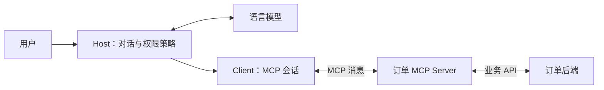

# MCP：连接 Agent 应用与外部能力的协议

假设订单团队已经提供 `get_order` API。桌面助手要查订单，IDE 助手也要查。如果两边分别约定工具名称、参数和返回格式，同一项能力就要适配两次。排错时，“连接成功”还可能只表示通信通道接通；工具名称尚未取得，订单查询也尚未执行。**连接、发现能力、执行业务是三个不同的阶段。**

模型上下文协议（Model Context Protocol，**MCP**）为应用连接外部工具和上下文定义了共同的通信方式，用来减少多个应用接入同一能力时重复编写的适配代码。它规定怎样协商连接、发现能力、发送调用与返回结果；订单是否可查，仍由订单系统决定。订单团队可以在已有 API 前放一个 MCP Server，桌面助手和 IDE 助手各自通过 MCP Client 发现它提供的工具，再由自己的应用决定是否调用。[官方规范：概览](https://modelcontextprotocol.io/specification/2025-06-18)

本课固定采用 **MCP 2025-06-18 规范**。原始资料于 2026-09-28 阅读；Tools 与 Lifecycle 官方页面于 2026-09-30 重新核对可访问，其余链接沿用原始阅读记录。这里不声称该版本是最新版。下面的订单、身份与结果都是教学假设，没有执行真实查询。读过 [Function Calling](#/lesson/function-calling) 后，可以把注意力从“模型怎样提出调用”转向“应用怎样发现并连接提供能力的服务”。

## 先认清谁在对话，谁在查订单

宿主应用（Host）是用户正在使用的助手产品，负责对话、模型接入、调用策略，以及把哪些外部内容交给模型。MCP 客户端（Client）是 Host 内部处理协议的组件，负责与某个 Server 建立会话、交换能力、发送请求。MCP 服务端（Server）提供一组具体能力，例如查订单或读取产品手册。一个 Host 可以管理多个 Client；每个 Client 与一个 Server 保持独立连接。Server 可以是本机进程，也可以是远程服务。[官方规范：Architecture](https://modelcontextprotocol.io/specification/2025-06-18/architecture)

订单数据库并不一定直接实现 MCP。常见的应用设计是：MCP Server 接受统一的调用消息，再调用已有订单 API。它承担协议到业务系统的适配，因此需要知道怎样把 `order_id` 转换成后端请求，以及怎样返回结果。Host 无须重新实现订单 API 的全部细节，但仍然要理解工具用途、处理用户同意和展示失败。



图中模型和 MCP Server 没有直接连线。Host 可以把工具定义转换为模型接口支持的格式，接收模型提出的调用，再经 Client 发送。模型看到什么上下文由 Host 决定；与一个 Server 建立连接，不意味着它能读取完整对话或其他 Server 的数据。

**Function Calling 处理模型怎样提出“调用哪个工具、传什么参数”；MCP 处理 Client 与 Server 怎样发现能力、发送调用和交换结果。**两者能够配合，也可以分别使用。应用可以直接调用普通函数，也可以让用户点击按钮触发 MCP 工具。MCP 规范没有指定模型的选择算法，也没有要求所有应用采用相同界面。[官方规范：协议总览](https://modelcontextprotocol.io/specification/2025-06-18)

## 接通以后，为什么还不能直接查订单

接通传输只是获得通信通道。在这个版本中，标准传输包括标准输入输出（stdio）和 Streamable HTTP。前者常用于 Host 启动的本机子进程；后者允许连接独立运行的服务。两者传递的协议消息都使用 JSON-RPC 2.0，其请求用 `id` 对应响应，通知则没有请求编号，也不期待对应响应。[官方规范：Transports](https://modelcontextprotocol.io/specification/2025-06-18/basic/transports)

随后开始初始化（initialization）：Client 发送 `initialize`，声明支持的协议版本、自身信息和可选能力；Server 返回它选择的版本、自身信息与提供的能力。成功后，Client 发出 `notifications/initialized`，双方才进入正常操作阶段。版本无法兼容时，应停止这次连接，而不是继续按自己猜测的格式调用。[官方规范：Lifecycle](https://modelcontextprotocol.io/specification/2025-06-18/basic/lifecycle)

能力协商（capability negotiation）回答“这次会话支持哪些协议功能”。Server 声明 `tools`，表示它提供工具接口；声明 `resources`，表示提供可读资源。`tools.listChanged` 表示会发送工具列表变化通知，不代表工具调用成功率，也不是订单读取权限。Client 声明的能力则描述反向请求等可选支持，和 Server 的能力并非同一份菜单。下面 Client 的空对象只表示它没有声明额外的客户端能力，仍可调用 Server 提供的工具。

## 沿一次订单查询走完协议消息

先固定输入与条件：用户在 Host 中问“订单 O-1042 发货了吗？”，已同意连接订单服务；本例假设当前身份属于租户 A，后端允许其查询 O-1042。下面展示**协议级教学消息**，省略具体 HTTP 头、凭据、模型接口格式和 SDK 代码。每个 JSON 块是一条独立消息，并非网络抓包；如果选用 stdio，实际发送时应将每条消息序列化为单行。

**第一步，建立会话。** Client 先请求初始化：

```json
{
  "jsonrpc": "2.0",
  "id": 1,
  "method": "initialize",
  "params": {
    "protocolVersion": "2025-06-18",
    "capabilities": {},
    "clientInfo": {"name": "lesson-order-client", "version": "1.0.0"}
  }
}
```

Server 接受该版本，声明仅提供工具。这里的 `version` 是示例程序版本，不能拿它代替 `protocolVersion`：

```json
{
  "jsonrpc": "2.0",
  "id": 1,
  "result": {
    "protocolVersion": "2025-06-18",
    "capabilities": {"tools": {}},
    "serverInfo": {"name": "lesson-order-server", "version": "1.0.0"}
  }
}
```

**第二步，发现能力。** Client 确认就绪，再请求工具列表：

```json
{"jsonrpc":"2.0","method":"notifications/initialized"}
```

```json
{"jsonrpc":"2.0","id":2,"method":"tools/list","params":{}}
```

Server 返回可用工具及输入 Schema：

```json
{
  "jsonrpc": "2.0",
  "id": 2,
  "result": {
    "tools": [{
      "name": "get_order",
      "description": "查询当前身份有权访问的订单状态，不修改订单。",
      "inputSchema": {
        "type": "object",
        "properties": {"order_id": {"type": "string"}},
        "required": ["order_id"],
        "additionalProperties": false
      }
    }]
  }
}
```

`tools/list` 只列出接口，没有查询 O-1042。这份列表若包含 `nextCursor`，Client 还需要继续取下一页，不能把首页误认为全部能力。Host 将相关定义提供给模型；在本例中，模型根据用户问题提出 `get_order` 及参数 `{"order_id":"O-1042"}`。Host 检查调用符合应用策略及用户同意范围后，才让 Client 发出下一条消息。**模型提出调用，不等于 Server 已经执行。**

**第三步，执行业务。** Client 发送 `tools/call`：

```json
{
  "jsonrpc": "2.0",
  "id": 3,
  "method": "tools/call",
  "params": {
    "name": "get_order",
    "arguments": {"order_id": "O-1042"}
  }
}
```

Server 校验参数和当前身份的访问范围，再向订单后端查询。假设后端返回“已发货”，Server 包装为工具结果：

```json
{
  "jsonrpc": "2.0",
  "id": 3,
  "result": {
    "content": [{
      "type": "text",
      "text": "订单 O-1042 的状态为已发货；发货日期为 2026-09-27。未提供预计送达日期。"
    }],
    "isError": false
  }
}
```

**第四步，形成回答。** Host 将结果交回模型，本例得到的最终回答是：“订单 O-1042 已于 2026-09-27 发货；当前结果没有预计送达日期。”日期来自假设的返回内容，不能由模型补成“明天送达”。回看整条链：`initialize` 建立会话，`tools/list` 发现能力，真正读取订单发生在 `tools/call` 之后。上述 `tools/list`、`tools/call`、`inputSchema` 和结果结构依据固定版本的 [Tools 规范](https://modelcontextprotocol.io/specification/2025-06-18/server/tools) 编写；订单记录和最终回答均为人工构造。

## 失败时沿哪条边界排查

初始化成功，只证明会话协商完成；列出 `get_order`，只证明发现了工具。收到调用响应，还要检查顶层是否有 JSON-RPC `error`，以及工具结果是否含 `isError: true`。后者可以表示工具已经被调用，但订单后端执行失败。不能因为 HTTP 通道有响应就告诉用户订单已查到。[官方规范：Tools 错误处理](https://modelcontextprotocol.io/specification/2025-06-18/server/tools)

假设把用户问题换成 O-2099：`tools/list` 仍返回 `get_order`，而 `tools/call` 返回 `isError: true` 和“当前身份无权访问该订单”。这证明工具发现成功，业务查询被拒绝；它既不能证明订单不存在，也不能说明整条 MCP 连接不可用。Host 应如实说明无法读取该订单，下一步再核对当前身份与订单权限。

## 工具之外还可以提供什么

同一个订单 Server 还可以提供资源（resources），例如一份用 URI 标识的订单状态说明。Client 用 `resources/list` 发现资源，用 `resources/read` 读取内容。资源强调可读取的上下文，Host 决定怎样展示或加入模型输入；它并不等于“把所有资料自动塞进对话”。[官方规范：Resources](https://modelcontextprotocol.io/specification/2025-06-18/server/resources)

提示模板（prompts）则提供可复用的消息结构，例如“按订单状态写一份客服回复”。Client 通过 `prompts/list` 发现模板，再用 `prompts/get` 传入参数获取消息。得到模板不代表订单已经查询，也不代表模板已作为高优先级指令执行。[官方规范：Prompts](https://modelcontextprotocol.io/specification/2025-06-18/server/prompts)

规范把 tools 描述为偏向模型控制、resources 偏向应用控制、prompts 偏向用户选择的原语。这些是典型用法，协议没有强制具体 UI。一个 Server 可以只实现其中一种；本例只声明 `tools`，Client 不能假设还能读取退货政策资源或获取客服模板。选择哪种接口，要考虑它是需要执行的动作，还是供应用读取的上下文，以及谁决定何时使用。

## 协议边界与授权取舍

`inputSchema` 说明订单号应是字符串，不说明这个用户是否拥有该订单。Host 负责用户同意和调用策略；MCP Server 及订单后端负责实际访问控制。本例把身份从已认证会话取得，而非让模型提交一个可随意填写的 `tenant_id` 作为权限依据。即使模型误选另一个租户的订单号，后端仍应拒绝越权读取。**协议让调用方式一致，业务授权仍要逐次落实。**

2025-06-18 的授权规范面向 HTTP 传输，采用 OAuth 相关机制；授权功能对 MCP 实现是可选项，不能由“支持 MCP”推断“必定使用 OAuth”。对受保护服务，Server 要校验访问令牌及其目标受众。令牌能访问 MCP Server，也不自动授予所有订单的业务权限；下游 API 需要自己的授权处理，不能把任意收到的令牌原样透传。[官方规范：Authorization](https://modelcontextprotocol.io/specification/2025-06-18/basic/authorization)

标准化减少了重复的发现与通信适配，也带来版本兼容、连接生命周期、凭据管理和跨层故障定位工作。若一个应用只调用一个稳定的内部函数，直接集成可能更简单；当同一组能力需要接入多个支持 MCP 的应用时，共同协议更有复用价值。仍需逐一验证目标 Host 支持的能力、当前身份的权限和实际调用结果。

<details>
<summary>面试怎么回答</summary>

**一分钟回答：MCP 解决了什么问题？**

MCP 是 Agent 应用与外部能力之间的协议。Host 管对话、模型和调用策略，内部 Client 与 Server 建立连接，Server 暴露工具、资源或提示模板。一次工具调用先经 `initialize` 协商版本和能力，再用 `tools/list` 发现接口，最后用 `tools/call` 执行。Function Calling 可以让模型提出工具名和参数，Host 再通过 MCP 调用 Server。连接、发现、执行是不同阶段，协议也不替业务系统决定用户权限。

**追问一：所有支持 MCP 的应用都能使用一个 Server 的全部功能吗？**

不能。先看协议版本和传输是否兼容，再看双方声明的能力及 Host 的实现。Host 可能只支持工具界面，没有资源展示入口。即使接口可用，当前身份的权限也可能不足。要分别检查协商结果、实际发现的接口和调用证据。

**追问二：tools/list 成功，tools/call 返回错误，应该先换模型吗？**

先定位错误层。工具不存在或参数不符合要求，要查名称、Schema 和调用消息；工具执行错误要看 Server 和后端返回；授权错误要查身份和权限。只有证据表明模型反复选错工具或参数，才应优先调整模型选择或提示。

**追问三：Server 需要部署一个 LLM 吗？**

提供订单查询能力不需要。它可以是校验参数、访问 API、返回结果的普通服务。模型可以由 Host 管理；MCP 本身也没有要求每个 Server 携带独立模型。

</details>

## 练习：连接成功以后还能缺什么

假设订单服务初始化时只返回 `{"tools":{}}`；工具列表包含 `get_order`，没有其他项。用户问“查 O-2099 的状态，并读取退货政策”。Host 随后调用 `resources/read` 失败，而订单调用返回 `isError: true`，内容为“当前身份无权访问该订单”。请说明两次失败各自说明什么，以及应用应该怎样回答。

<details>
<summary>参考思路</summary>

Server 没有声明 resources，当前会话也没有发现退货政策资源。Host 不应根据一句自然语言请求推断该能力存在，可以说明此连接未提供可用的政策读取接口。订单工具已经被发现，但执行遭到访问控制拒绝；不能把它描述为“订单不存在”，也不能编造状态。

合适的回答是：“当前身份无法读取 O-2099 的状态；此连接也未提供退货政策资源。”后续分别核对订单访问权限和政策来源。把两个问题都归为 MCP 不可用，会丢失已经确认的事实：初始化和工具发现成功，订单权限及资源能力没有满足这次请求。

</details>
