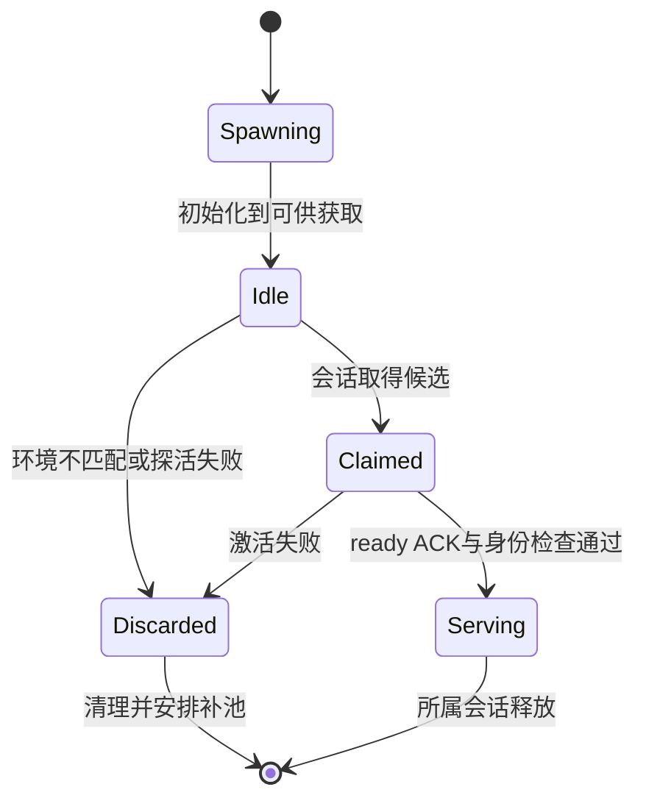

# WorkBuddy 的会话恢复：预热、旧回调与请求重放

假设 Agent 正在修改一个工作簿。工具完成了写入，返回结果却在本地连接断开时丢失。界面显示“连接失败”，用户点击继续。应用可以重建连接，但能否直接重发上一条请求？如果模型再次执行同一操作，工作簿可能多出第二个汇总页。桌面 Agent 的恢复逻辑必须处理这种“动作可能发生、结果尚未确认”的情况。

另一个常见现象是第一条消息很慢，第二条明显更快。它可能与模型推理有关，也可能只是 CLI（命令行执行程序）加载模块、初始化插件和建立连接花了时间。WorkBuddy 将进程预热与业务会话恢复分开实现：预热是提前启动执行程序，让第一次请求少等一部分初始化；恢复是在连接断开后确认哪些对象仍有效、哪个请求可以再次发送。两者解决的是不同的等待与故障，不能把它们都归为“网络不稳定”。

本篇跟踪 WorkBuddy 5.6.2 中的 `CliPrewarmPool` 和 `CodeBuddyCodeSessionBackend`。先读[会话入口](#/lesson/workbuddy-session)与[工具失败](#/lesson/tool-reliability)。源码核验于 2026-09-28，下面的进程号、序号和时间顺序都是教学假设；未结束任何用户进程，也没有执行断线故障注入。

## 预热池究竟复用了什么

预热池保存的是已启动、等待激活的 CLI 进程，不是上一次用户任务的推理答案。它提前承担部分进程与模块初始化成本。Backend 创建会话时先尝试取得一个候选，成功后给它工作目录、参数、sessionId 和允许的环境增量；失败则回到 runtime manager 的冷启动路径。[获取逻辑：S02](https://jiuchenm.github.io/workbuddy-study/#S02)

这一步最容易漏掉环境一致性。假设预热进程启动时使用环境配置 E1，用户切换项目后要求 E2。进程已经启动，不代表它天然适合新项目。`tryAcquire` 先检查 session 环境增量中的键是否允许，再将候选的启动环境与本次增量合并，比较它与本次冷启动本应使用的 runtimeManagedEnv。存在差异时，候选被标记丢弃、从池中移除并终止，再安排补池。[比较与淘汰：S03](https://jiuchenm.github.io/workbuddy-study/#S03)

例如，候选对应某代理配置，当前会话已切到另一配置。仅复制 sessionId 并不能更新所有已经初始化的依赖。拒绝复用会多付一次冷启动成本，但可以避免新会话继续使用旧进程条件。这是代码允许的决策，不表示本机测出了多少性能收益。

命中候选之后还有激活确认。`doActivate` 发送 cwd、args、sessionId，并要求 ready ACK；收到结果后验证返回的进程身份与会话身份，再使用其实际端口。能够 ping 到进程、IPC 已监听、业务端点完成准备是不同状态。若激活失败，池清理该候选并带退避补充资源，Backend 才继续冷启动。[激活握手：S55](https://jiuchenm.github.io/workbuddy-study/#S55)

可用下面的教学状态图理解主路径。它合并了若干实现细节，不是源代码里完整的枚举：



实现中 tryAcquire 会先将候选状态设为 activated，以防其他获取者再次选中；真正的 ready 确认随后发生。因此 activated 字段的早期变化也不能孤立地当作 ACP 已可服务的证据。

## 为什么把探活移出获取路径

如果每次取得候选前都同步 ping，就会把“观察进程健康”的耗时加入用户启动路径。更麻烦的是，进程刚监听 IPC 时可能仍在加载模块，事件循环繁忙。一次很短的探活超时可能只是没有及时响应，而不是进程永久失效。

可见代码把空闲候选的健康探测放到后台定时器，tryAcquire 主要同步读取状态和检查环境。激活自己仍有失败处理，所以取得候选并不免除后续验证。文件注释记载了过急探活导致误淘汰的历史，但其耗时数字是作者注释，不能当作本轮基准。[预热池检查范围：S03、S55](https://jiuchenm.github.io/workbuddy-study/#S03)

清理池也不能把正在服务的会话一并杀掉。flush 只选择 idle/spawning 候选，activated 会话由 session 生命周期管理。并发 flush 共享同一个进行中 Promise，完成周期内的补池意图被记录，避免每个配置变化都同时重建一批进程。daemon 停止时则有另一条 stop 路径，处理仍由池跟踪的全部资源。

启动时清理旧账的逻辑还检查 prewarm 标识和进程命令行，避免单凭 PID 文件杀掉后来复用这个 PID 的无关进程。这里管理的是操作系统资源身份。稍后会看到，会话事件也需要一个类似但不同的身份保护。

## 重连之后，旧回调为什么不能继续写状态

假设会话 S 原先连接 runtime R1，R1 的一个事件已经在路上。连接中断后，应用建立 R2；R1 的事件随后才抵达。两条事件都可能写着相同的 sessionId，因为用户仍处于同一会话。只比较 sessionId，无法知道哪个 runtime 仍拥有更新权。

Backend 每次成功取得 runtime 时递增 `runtimeOwnershipEpoch`，创建 client 时捕获该值。回调先检查当前 epoch 是否相同，还检查这个 client 是否仍在 activeCallbackClients 集合中。两者同时满足，才向上转发 session update、提问、权限请求或 transport activity。[回调筛选：S31](https://jiuchenm.github.io/workbuddy-study/#S31)

用整数模拟：R1 捕获 epoch=7；soft reset 释放它的所有权；R2 建立后使用 epoch=8。R1 的晚到消息即使 sessionId=S，也会因为 7 不等于当前 8 而被忽略。active client 集合还提供一次独立检查，使已停用 client 的回调失效。这些机制处理消息归属，不负责证明业务动作是否完成。

softReset 与 destroy 的后果也不同。softReset 递增 resetEpoch，停用旧 client 回调、清空连接和端点，并释放 runtime，但保留初始化请求及可继续使用的 backend 对象。下一次需要连接时重新初始化。destroy 则标记对象已销毁，同时清理关联临时配置和资源。[对象生命周期：S56](https://jiuchenm.github.io/workbuddy-study/#S56)

resetEpoch 还用来防止初始化过程在中途被重置后继续提交结果。一次异步初始化开始时记住旧 epoch，在关键 await 之后检查；如果 reset 已经发生，旧初始化不能再把过时 client 安装回当前对象。这里需要的是“这次工作是否仍有资格提交”，单纯给请求加超时无法回答这个问题。

## 同样是断线，哪些请求可以重试

prompt 路径先确保会话初始化，再通过 connection 发送请求。捕获错误后，代码区分本地 loopback endpoint 不可用与一般 transport 故障。ECONNREFUSED、AGENT_UNAVAILABLE 一类会触发 soft reset 后重试一次；ECONNRESET、ETIMEDOUT、stream ended 等归入另一类，标记 `after_send_or_unknown` 和 replay unsafe，清理连接后抛出，让后续显式请求决定下一步。[发送与错误分支：S33、S34](https://jiuchenm.github.io/workbuddy-study/#S33)

区别在于能否排除业务已经开始。连接被拒绝通常说明目标端点没有接住请求；发出后断流则可能发生在任意阶段。应用没有收到结果，不代表对端没有执行。在工作簿例子中，后者应该先恢复连接、查询文件状态，再决定继续，不能自动重新生成一个相同汇总页。

这个实现仍不是 exactly-once 保证。错误码只是在当前边界提供线索，不是外部业务的事务证明。若一个工具调用跨出本机，真正避免重复提交还可能需要业务 operationId、幂等键或状态查询。Agent 对话中的 requestId 主要用于关联请求，除非目标服务明确以它去重，否则不能直接充当业务幂等键。

配置更新走另一条规则。可见代码将 set_config_option 的部分 transport 故障也纳入重置后重试，因为把配置字段设成同一个值在这里被视为幂等；通用 extension 入口还承载入队、立即发送等动作，不能全部套用该策略。重试范围根据操作语义划分，而不是只依据它们都使用同一个 HTTP 客户端。[配置重试说明与分支：S56](https://jiuchenm.github.io/workbuddy-study/#S56)

一次假设时序可以检查这种差异：

```text
t0  设置 thought_level=high，连接重置
t1  重建连接后再次设置同一值：可采用配置重试分支
t2  发送“在工作簿新增汇总页”，结果流中断
t3  重建连接：只恢复通道，不能据此认定 t2 未执行
t4  查询已有产物/任务标识后，决定续接或重新执行
```

## 取消为什么也需要序号

取消操作不总能立即发出。代码中的 cancel 先记录当前 promptSeq，再 await ensureInitialized。假设在等待期间用户已经提交了下一条 prompt，promptSeq 增加；这时旧 cancel 应该被跳过，否则它会误取消新请求。[取消保护：S32](https://jiuchenm.github.io/workbuddy-study/#S32)

epoch 和 promptSeq 解决的是两种问题。epoch 区分不同 runtime 代际，promptSeq 区分同一 backend 的请求进展。它们都不是业务文件版本。把全部标识合成一个 ID，会让“旧连接消息”“旧取消请求”“旧产物结果”难以分别判断。

分析故障时可以先记录四条信息：sessionId 指向哪段会话；runtime epoch 指向哪个执行实例；promptSeq/requestId 指向哪轮输入；业务对象 ID 指向哪个实际动作或产物。之后再检查连接错误发生在何处、已有何种后端活动、是否标记 replay unsafe、用户最终看到了什么。这样才能区分启动慢、会话失效、业务超时和重复执行风险。

<details>
<summary>面试怎么回答</summary>

一分钟回答：WorkBuddy 的预热池复用已经启动的 CLI，但先校验环境，再通过带身份检查的 ready ACK 激活。会话重连时，backend 用 epoch 和 active client 集合过滤旧回调，softReset 保留逻辑会话，destroy 才终结对象。请求重试又单独分类：本地端点拒连可重置重试，发送后未知状态则标记不宜自动重放。取消也比较 promptSeq，避免延迟取消落到新请求。连接恢复、请求重试和业务幂等必须分别设计。

追问一：为什么有 sessionId 还要 epoch？同一用户会话可以更换 runtime，旧 runtime 的晚到事件仍带同一 sessionId。epoch 表示当前哪一代实例有更新资格。

追问二：把重试次数设为一就安全了吗？不安全。即使只重复一次，扣款、发消息或新增文件也可能重复。必须先判断操作语义和是否已发生，次数只能限制放大程度。

追问三：ping 成功是否表示可以发送业务？不一定。进程可响应、协议已连接、会话已加载是不同阶段，应等待对应 ready 语义，并验证它属于预期进程和会话。

</details>

练习：一个 cancel 捕获 promptSeq=12，等待初始化期间用户发出新请求，序号变成13。同时，旧 runtime 的更新携带 epoch=4，而当前为5。两条消息分别应该怎样处理？这能否证明第12轮业务没有修改文件？

<details>
<summary>练习参考思路</summary>

cancel 比较序号后跳过，避免取消第13轮；旧 runtime 回调因 epoch 不匹配被忽略。这两项只限制之后谁能控制或更新会话，不撤销第12轮已经产生的文件修改。要判断业务结果，仍需读取产物或业务系统状态，并关联实际 operationId 或文件版本，不能从“旧消息被忽略”推出“动作没有发生”。

</details>
